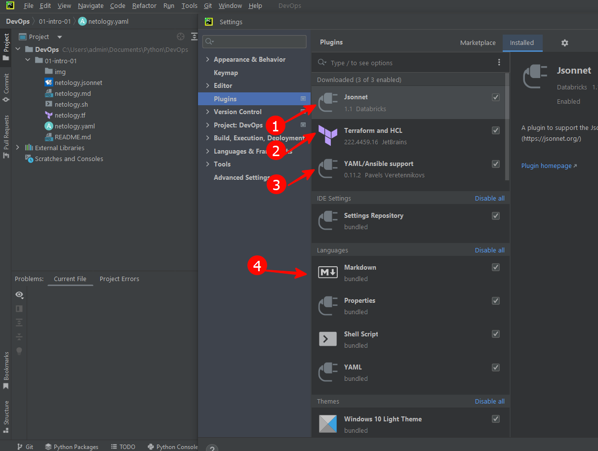
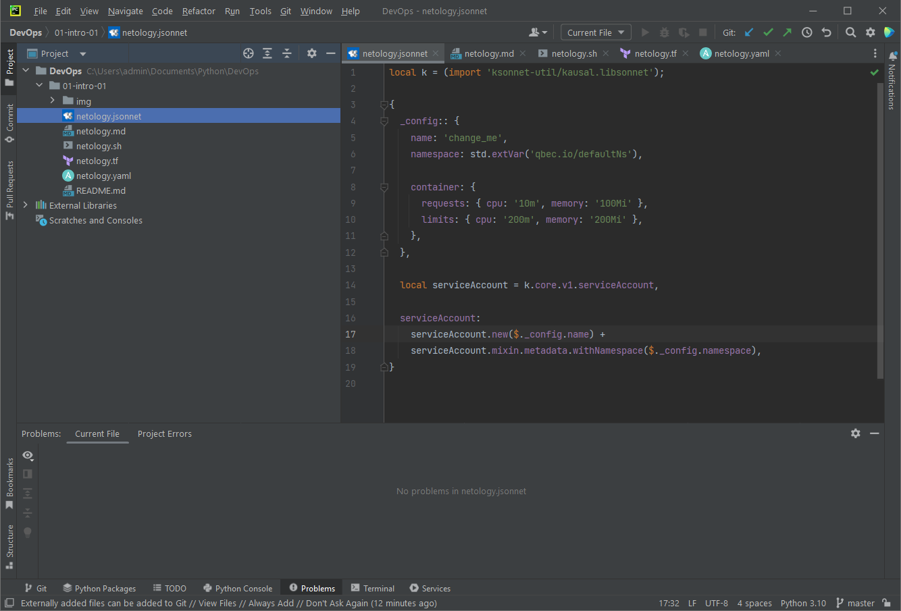
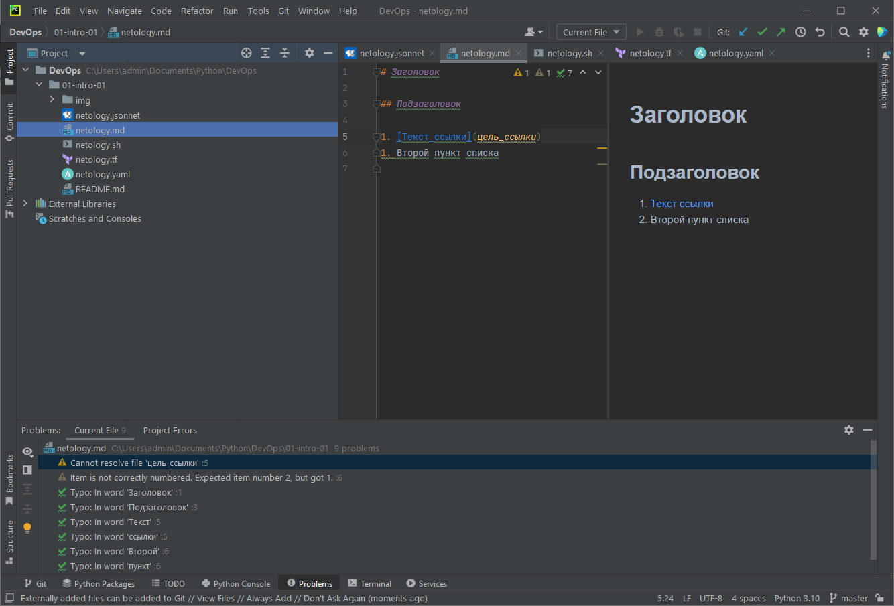
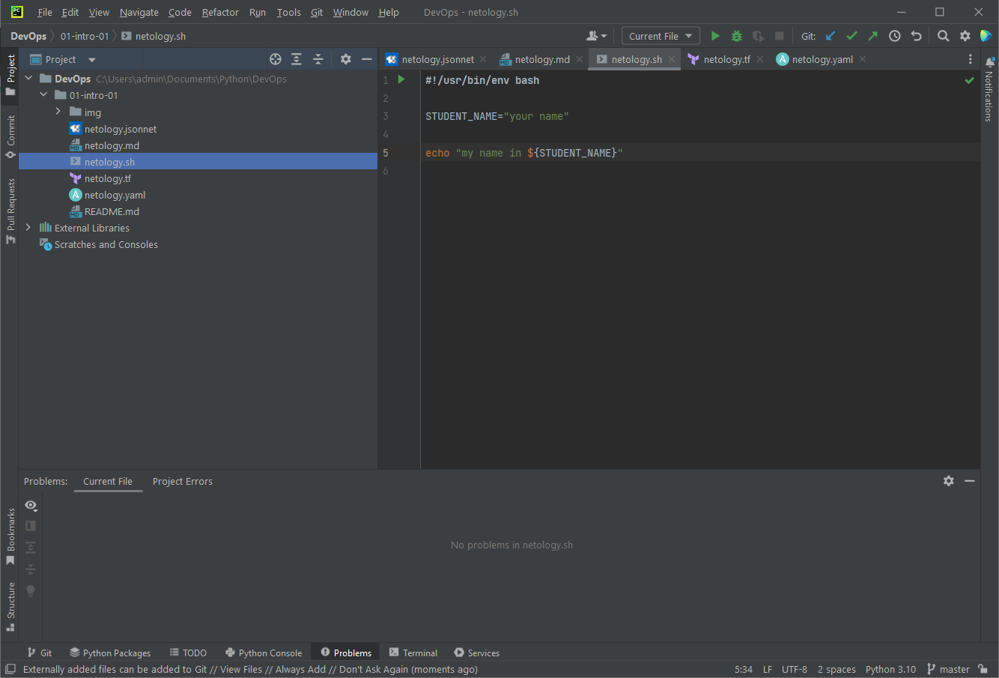
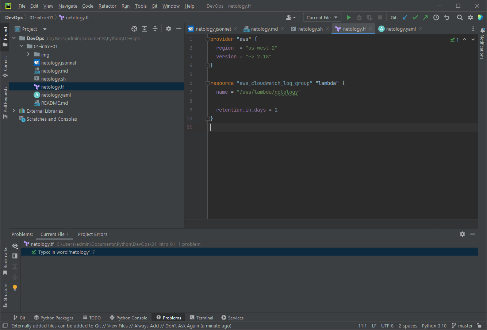
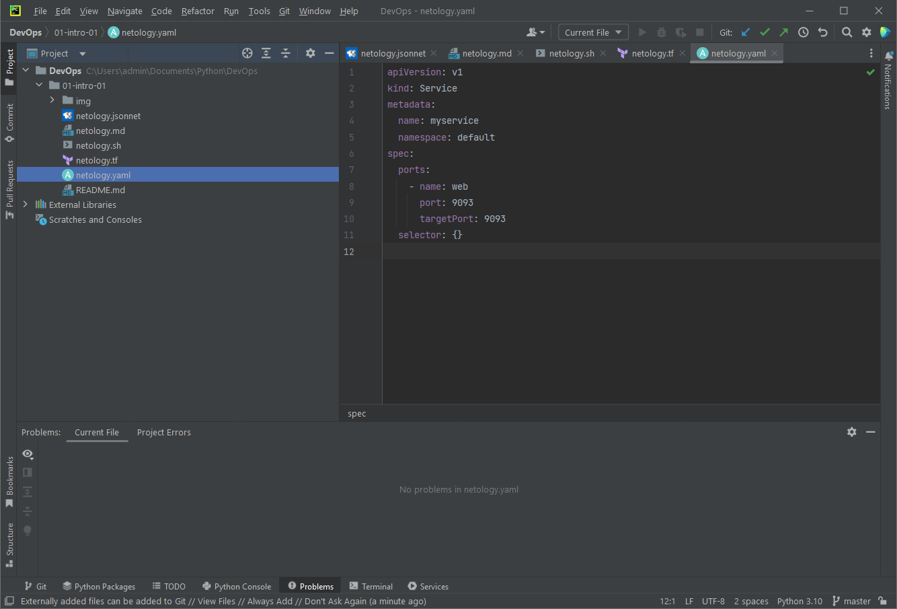

# Домашнее задание 01-intro-01

 

## Задание 1. Подготовка рабочей среды

### 1) Установленные плагины:

### 2) Jsonnet:

### 3) MarkDown:

### 4) Bash:

### 5) Terraform:

### 6) Yaml/Ansible Support:

 

## Задание 2. Описание жизненного цикла задачи (разработки нового функционала)

Команда должна общими усилиями сформировать план работ над проектом.

### Менеджер проекта
Для настройки процессов менеджеру проекта необходимо декомпозировать новый функционал на ряд задач, внести основные из них в трекер задач.
Распределить задачи по спринтам, составляющим этапы разработки.
Обсудить с командой разработки и удостовериться, что они смогут реализовать запланированные задачи в установленный срок.
Менеджер проекта осуществляет проверку опубликованных версий перед показом клиенту.
Отслеживает дедлайны по спринтам, проводит оценку выполнения работ.
Следит за бюджетом проекта.

### Разработчики
Команда разработки совместно с менеджером проекта обсуждают и оценивают задачи, дополняя трекер задач новой информацией.
В соответствии с приоритетом по трекеру задач, программисты разрабатывают новый функционал.
Так же в их обязанности входит написание модульных тестов.

### Тестировщики
Тестировщики выполняют оценку качества по завершенным разработчиками задачам.
Проводят как модульные тестирования, так и разрабатывают интеграционные, функциональные, приёмочные и другие тесты, для выявления багов и ошибок.
Отслеживают результаты тестов в CI системах, и разрабатывают автоматизированные тесты.

### DevOps-инженер
Настраивает CI/CD системы, а так же окружения для публикации приложений (Dev / Stage / Production и др.).
Настраивают логирование и мониторинг. Контролируют успешность сборок и развёртывания.
Дополнительно DevOps-инженеру совместно с разработчиками желательно следить за безопасностью приложения (статические анализаторы, сканирование на уязвимости и т.д.).
