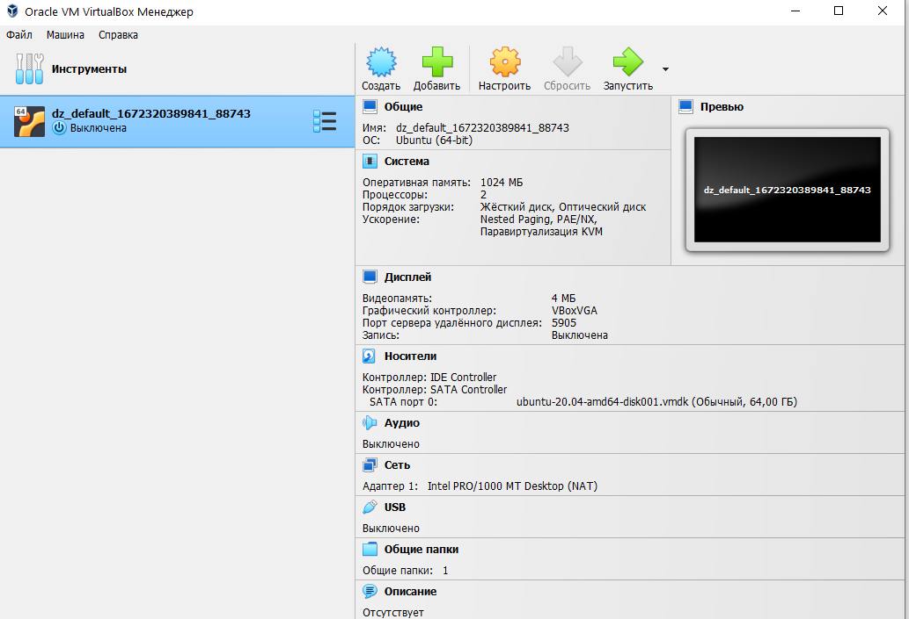
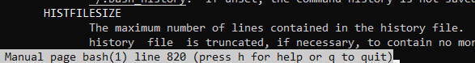
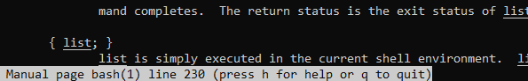

# Домашнее задание 03-sysadmin-01-terminal

<br>

Скачал установочный файл **Oracle VirtualBox** и установил под **Windows 10**.<br><br>
Скачал установочный файл **Hashicorp Vagrant** и установил под **Windows 10**.<br><br>
В папке ***C:\Program Files (x86)\Vagrant\embedded\bin*** обновил **Curl**.<br><br>
В настройках **Kaspersky Internet Security** добавил исполняемый файл ***C:\Program Files (x86)\Vagrant\bin\vagrant.exe*** в исключения, чтобы для него не проверялся зашифрованный трафик.<br><br>
Установил **Windows Terminal**.
<br>

## Задание 1. С помощью базового файла конфигурации запустите Ubuntu 20.04 в VirtualBox посредством Vagrant:
Создал папку для домашнего задания и выполнил в ней через **Windows Terminal** команду `vagrant init`.<br><br>
Отредактировал **Vagrantfile**, выполнил команду `vagrant up`, проверил команды `vagrant suspend`, `vagrant halt`
<br>

## Задание 2. Ознакомьтесь с графическим интерфейсом VirtualBox, посмотрите как выглядит виртуальная машина, которую создал для вас Vagrant, какие аппаратные ресурсы ей выделены. Какие ресурсы выделены по-умолчанию?
Ознакомился с интерфейсом VirtualBox, и посмотрел стандартные настройки виртуальной машины:


<br>

## Задание 3. Ознакомьтесь с возможностями конфигурации VirtualBox через Vagrantfile: документация. Как добавить оперативной памяти или ресурсов процессора виртуальной машине?
Изучил документацию, отредактировал файл **Vagrantfile**:<br>
```
Vagrant.configure("2") do |config|
	config.vm.box = "bento/ubuntu-20.04"
	config.vm.provider "virtualbox" do |v|
		v.customize ["modifyvm", :id, "--memory", 2048]
		v.customize ["modifyvm", :id, "--cpus", 1]
	end
end
```
Применил изменения командой `vagrant reload`.
<br>

## Задание 4. Команда vagrant ssh из директории, в которой содержится Vagrantfile, позволит вам оказаться внутри виртуальной машины без каких-либо дополнительных настроек. Попрактикуйтесь в выполнении обсуждаемых команд в терминале Ubuntu.
Подключился к виртуальной машине с помощью команды `vagrant ssh`.
<br>

## Задание 5. Ознакомьтесь с разделами `man bash`, почитайте о настройках самого bash.
### ***Какой переменной можно задать длину журнала `history`, и на какой строчке manual это описывается?***
Длина журнала задаётся аргументом **HISTFILESIZE**, строка в мануале: 819.



### ***Что делает директива `ignoreboth` в bash?***
**ignoreboth** - сокращение от **ignorespace** и **ignoredups** в переменной **HISTCONTROL**.<br><br>
**ignorespace** - позволяет не сохранять в историю команды, начинающиеся с пробельного символа;<br><br>
**ignoredups** - приводит к тому, что строки, соответствующие предыдущей записи истории, не сохраняются.
<br>

## Задание 6. В каких сценариях использования применимы скобки `{}` и на какой строчке `man bash` это описано?
Скобки `{}` применимы для работы со списками. Команды выполняются в текущем окружении. Cтрока в мануале: 230.


<br>

## Задание 7. С учётом ответа на предыдущий вопрос, как создать однократным вызовом `touch` 100000 файлов? Получится ли аналогичным образом создать 300000? Если нет, то почему?
Пример команды для создания 100000 файлов:

### *touch {000001..100000}.txt*

Аналогичным способом создать 300000 файлов нельзя из-за ограничения на списки в 100000 элементов.
<br>

## Задание 8. В man bash поищите по `/\[\[`. Что делает конструкция `[[ -d /tmp ]]`
Для работы с условными выражениями используются двойные квадратные скобки `[[ выражение ]]`.<br><br>
Конструкция `[[ -d /tmp ]]` проверяет существует ли файл и является ли он каталогом.
<br>

## Задание 9. Сделайте так, чтобы в выводе команды `type -a bash` первым стояла запись с нестандартным путем, например bash is ... Используйте знания о просмотре существующих и создании новых переменных окружения, обратите внимание на переменную окружения PATH
```
sudo mkdir -p /tmp/new_path_directory/
sudo mkdir -p /usr/local/bin/

sudo cp /bin/bash /tmp/new_path_directory/
sudo cp /bin/bash /usr/local/bin/

vim ~/.profile
В конце файла добавить PATH="/tmp/new_path_directory/:/usr/local/sbin:/usr/local/bin:/bin/:/usr/sbin:/usr/bin:/sbin:/usr/games:/usr/local/games:/snap/bin"
Далеей необходимо обновить переменные окружения (Выйти из системы и зайти заново или подключиться к localhost по ssh)

exit / vagrant ssh

vagrant@vagrant:~$ type -a bash
bash is /tmp/new_path_directory/bash
bash is /usr/local/bin/bash
bash is /bin/bash
bash is /usr/bin/bash
```
<br>

## Задание 10. Чем отличается планирование команд с помощью `batch` и `at`?
**at** - позволяет планировать одноразовые задачи, например в определённое время.<br><br>
**batch** - позволяет настраивать запуск одноразовых задач когда средняя нагрузка системы упадёт ниже 1.5 *(судя по man batch)*
<br>

## Задание 11. Завершите работу виртуальной машины чтобы не расходовать ресурсы компьютера и/или батарею ноутбука.
Выполнил команду `vagrant halt`.
<br>