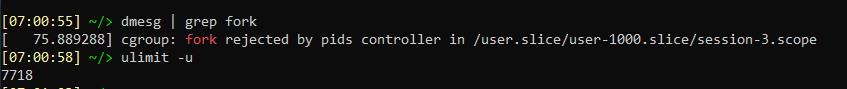

# Домашнее задание 03-sysadmin-04-os

<br>

## Задание 1. На лекции мы познакомились с `node_exporter`. В демонстрации его исполняемый файл запускался в background. Этого достаточно для демо, но не для настоящей production-системы, где процессы должны находиться под внешним управлением. Используя знания из лекции по systemd, создайте самостоятельно простой unit-файл для node_exporter:

### Установим `node_exporter`:
```
wget https://github.com/prometheus/node_exporter/releases/download/v1.5.0/node_exporter-1.5.0.linux-amd64.tar.gz
tar xvf node_exporter-1.5.0.linux-amd64.tar.gz
cd node_exporter-1.5.0.linux-amd64
sudo mv node_exporter /usr/sbin
```

### Помещаем его в автозагрузку

Для этого создаем файл **/etc/systemd/system/node_exporter.service** со следующим содержимым:
```
[Unit]
Description=Node Exporter

[Service]
EnvironmentFile=/etc/default/node_exporter
ExecStart=/usr/sbin/node_exporter $OPTIONS

[Install]
WantedBy=multi-user.target
```

И выполняем следующие команды, которые добавят его в автозагрузку и запустят:
```
sudo systemctl daemon-reload
sudo systemctl enable node_exporter.service
sudo systemctl start node_exporter
```
### Предусмотрите возможность добавления опций к запускаемому процессу через внешний файл (посмотрите, например, на `systemctl cat cron`):
Опции к запускаемому процессу добавляются через параметр `EnvironmentFile`

### Удостоверьтесь, что с помощью systemctl процесс корректно стартует, завершается, а после перезагрузки автоматически поднимается:
Выполняем команды для проверки:
```
sudo systemctl stop node_exporter.service
sudo systemctl status node_exporter.service
```


```
sudo systemctl stop node_exporter.service
sudo systemctl status node_exporter.service

sudo systemctl start node_exporter.service
sudo systemctl status node_exporter.service
```


После перезагрузки сервис запустился автоматически:


<br>

## Задание 2. Ознакомьтесь с опциями node_exporter и выводом `/metrics` по-умолчанию. Приведите несколько опций, которые вы бы выбрали для базового мониторинга хоста по CPU, памяти, диску и сети.

### Опции для базового мониторинга, например:
```
--collector.cpu
--collector.meminfo
--collector.diskstats
--collector.netdev
```


## Задание 3. Установите в свою виртуальную машину Netdata. Воспользуйтесь готовыми пакетами для установки (`sudo apt install -y netdata`).

Устанавливаем **Netdata** и правим конфигурационный файл **/etc/netdata/netdata.conf**, в секции **[global]** заменяем `localhost` на `0.0.0.0`
```
bind socket to IP = 0.0.0.0
```

Добавляем в файл **Vagrantfile** проброс порта:
```
config.vm.network "forwarded_port", guest: 19999, host: 19999
```
Перечитываем конфиг командой `vagrant reload`.<br>

В браузере по адресу `http://localhost:19999` наблюдаем:


<br>

## Задание 4. Можно ли по выводу `dmesg` понять, осознает ли ОС, что загружена не на настоящем оборудовании, а на системе виртуализации?
Да.
```
dmesg -T | grep -i virt
```


## Задание 5. Как настроен `sysctl fs.nr_open` на системе по-умолчанию? Определите, что означает этот параметр. Какой другой существующий лимит не позволит достичь такого числа (`ulimit --help`)?

`fs.nr_open` - параметр определяет максимальное число открытых файлов в одном процессе.<br>
```
fs.nr_open = 1048576
```
Однако достичь такого значения не получится из-за ограничений накладываемых системой на процесс терминала и порождаемые им процессы.<br>
```
ulimit -a | grep open
1024
```
Значение можно увеличить для текущей сеcсии терминала при помощи `ulimit -n XXXXX`, но новое значение не должно превышать жёсткий лимит для данного параметра (получить список жёстких лимитов можно при помощи `ulimit -aH`).
<br>

## Задание 6. Запустите любой долгоживущий процесс (не `ls`, который отработает мгновенно, а, например, `sleep 1h`) в отдельном неймспейсе процессов; покажите, что ваш процесс работает под PID 1 через `nsenter`. Для простоты работайте в данном задании под root (`sudo -i`). Под обычным пользователем требуются дополнительные опции (`--map-root-user`) и т.д.
Запустим процесс в изолированном от хоста неймспейсе.
```
sudo -i
unshare -f --pid --mount-proc /usr/bin/sleep 1h &
```
Выполним команду `ps aux | grep sleep` и узнаем какой `PID` у созданного нами процесса.


После этого подключимся к процессу и выведем список процессов в одном с ним неймспейсе.
```
nsenter --target 1702 --pid
ps aux
```

## Задание 7. Найдите информацию о том, что такое `:(){ :|:& };:`. Запустите эту команду в своей виртуальной машине Vagrant с Ubuntu 20.04 (**это важно, поведение в других ОС не проверялось**). Некоторое время все будет "плохо", после чего (минуты) – ОС должна стабилизироваться. Вызов `dmesg` расскажет, какой механизм помог автоматической стабилизации. Как настроен этот механизм по-умолчанию, и как изменить число процессов, которое можно создать в сессии?
Команда `:(){ :|:& };:` создаёт функию, которая вызывает дважды сама себя. Второй процесс запускается в фоне (`&`).<br>

Это приводит к непрерывному порождению новых процессов (fork). Восстановиться системе помогло ограничение на число запускаемых процессов.<br>

Дополнительное ограничение можно установить в файле **/etc/security/limits.conf**



<br>