# Домашнее задание 03-sysadmin-05-fs

<br>

## Задание 1. Узнайте о sparse (разряженных) файлах.
Изучил.
<br>

## Задание 2. Могут ли файлы, являющиеся жесткой ссылкой на один объект, иметь разные права доступа и владельца? Почему?
Файлы, которые являются жёсткой ссылкой, не могут иметь разные права доступа, т.к. они имеют тот же inode и набор прав (разрешений), что и оригинальный файл.<br>

Разрешения на ссылку меняются при изменении разрешений исходного файла.
<br>

## Задание 3. Сделайте `vagrant destroy` на имеющийся инстанс Ubuntu. Замените содержимое Vagrantfile представленным далее. Данная конфигурация создаст новую виртуальную машину с двумя дополнительными неразмеченными дисками по 2.5 Гб.
```
path_to_disk_folder = './disks'

host_params = {
    'disk_size' => 2560,
    'disks'=>[1, 2],
    'cpus'=>2,
    'memory'=>2048,
    'hostname'=>'sysadm-fs',
    'vm_name'=>'sysadm-fs'
}
Vagrant.configure("2") do |config|
    config.vm.box = "bento/ubuntu-20.04"
    config.vm.hostname=host_params['hostname']
    config.vm.provider :virtualbox do |v|

        v.name=host_params['vm_name']
        v.cpus=host_params['cpus']
        v.memory=host_params['memory']

        host_params['disks'].each do |disk|
            file_to_disk=path_to_disk_folder+'/disk'+disk.to_s+'.vdi'
            unless File.exist?(file_to_disk)
                v.customize ['createmedium', '--filename', file_to_disk, '--size', host_params['disk_size']]
            end
            v.customize ['storageattach', :id, '--storagectl', 'SATA Controller', '--port', disk.to_s, '--device', 0, '--type', 'hdd', '--medium', file_to_disk]
        end
    end
    config.vm.network "private_network", type: "dhcp"
end
```

Создал новую виртуальную машину.

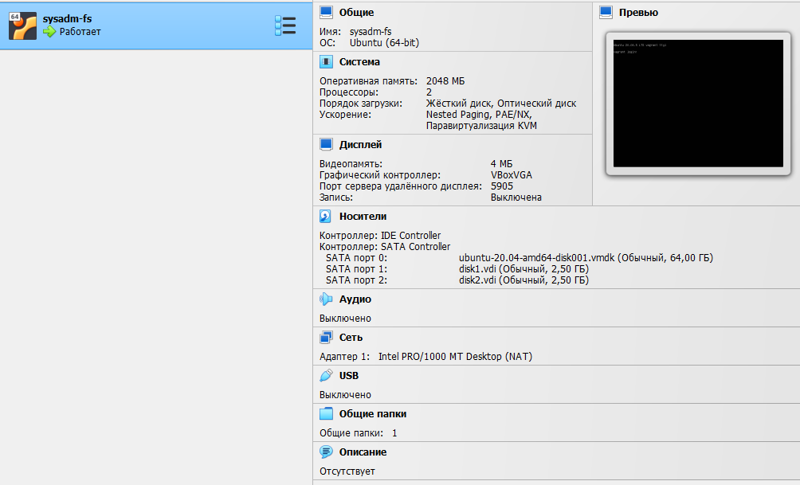
<br>

## Задание 4. Используя `fdisk`, разбейте первый диск на 2 раздела: 2 Гб, оставшееся пространство.
```
sudo fdisk -l
sudo fdisk /dev/sdb
g
n
1
+2G
w

sudo fdisk /dev/sdb
n
2
p
w

sudo fdisk -l
```

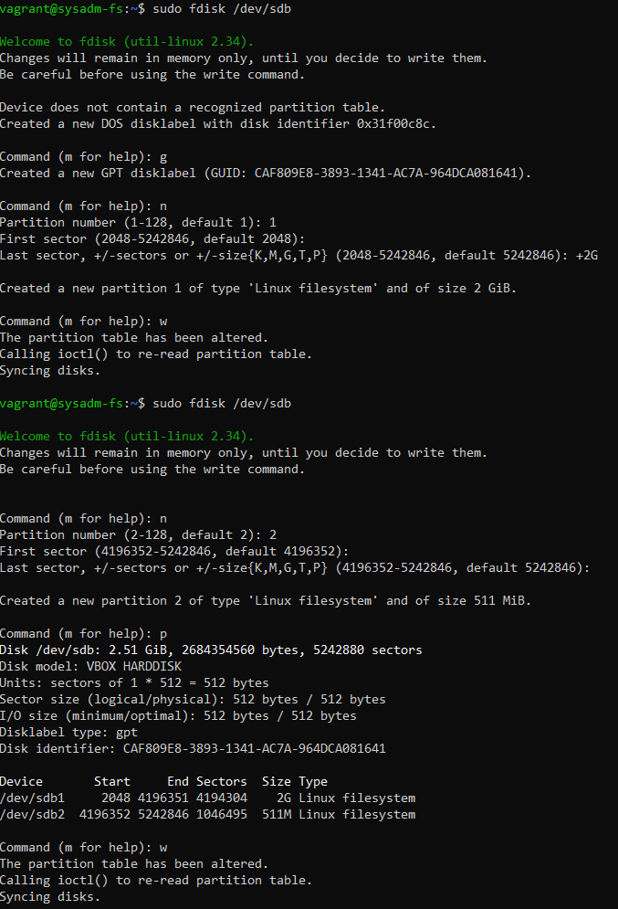
<br>

## Задание 5. Используя `sfdisk`, перенесите данную таблицу разделов на второй диск.
```
sudo sfdisk -d /dev/sdb > partitions.txt
sudo sfdisk /dev/sdc < partitions.txt
```
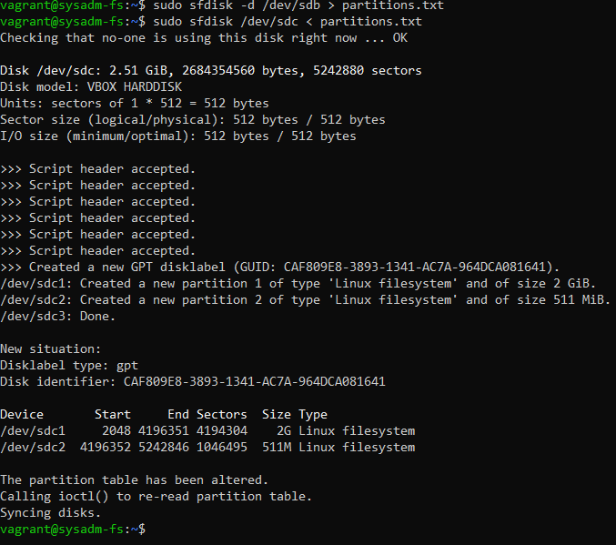
<br>

## Задание 6. Соберите `mdadm` RAID1 на паре разделов 2 Гб.
```
sudo mdadm --create --verbose /dev/md0 --level=1 --raid-devices=2 /dev/sdb1 /dev/sdc1
```
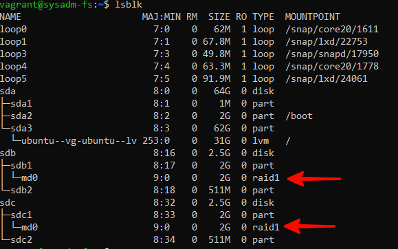
<br>

## Задание 7. Соберите `mdadm` RAID0 на второй паре маленьких разделов.
```
sudo mdadm --create --verbose /dev/md1 --level=0 --raid-devices=2 /dev/sdb2 /dev/sdc2
```
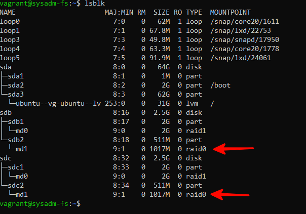
<br>

## Задание 8. Создайте 2 независимых PV на получившихся md-устройствах.
```
sudo pvcreate /dev/md0 /dev/md1
```
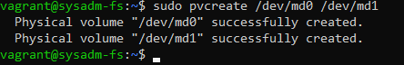
<br>

## Задание 9. Создайте общую volume-group на этих двух PV.
```
sudo vgcreate vg0 /dev/md0 /dev/md1
```
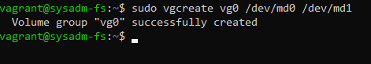
<br>

## Задание 10. Создайте LV размером 100 Мб, указав его расположение на PV с RAID0.
```
sudo lvcreate -L 100 -ntestlv vg0 /dev/md1
```
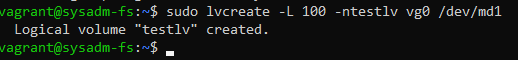
<br>

## Задание 11. Создайте `mkfs.ext4` ФС на получившемся LV.
```
sudo mkfs.ext4 /dev/vg0/testlv
```
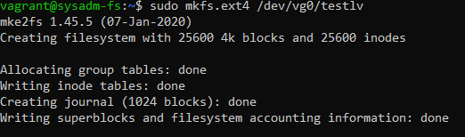
<br>

## Задание 12. Смонтируйте этот раздел в любую директорию, например, `/tmp/new`.
```
sudo mkdir /tmp/new
sudo mount /dev/vg0/testlv /tmp/new
```
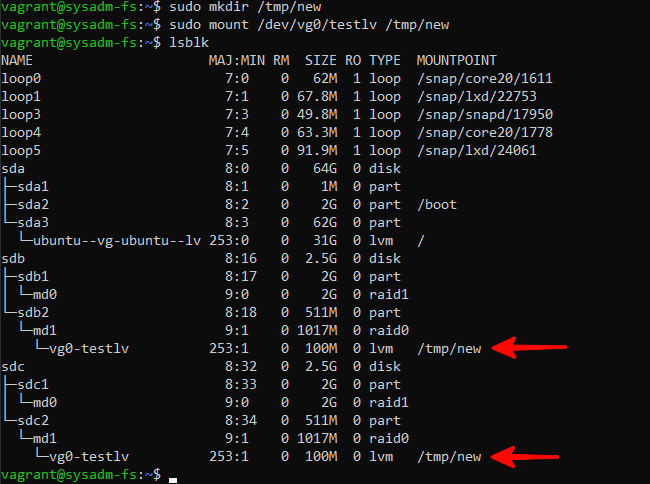
<br>

## Задание 13. Поместите туда тестовый файл, например `wget https://mirror.yandex.ru/ubuntu/ls-lR.gz -O /tmp/new/test.gz`.
```
sudo wget https://mirror.yandex.ru/ubuntu/ls-lR.gz -O /tmp/new/test.gz
```
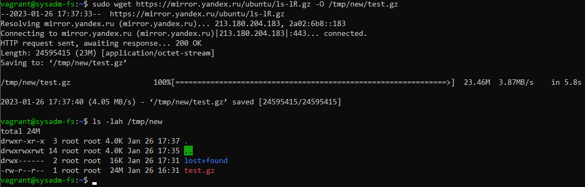
<br>

## Задание 14. Прикрепите вывод `lsblk`.
См. задание 12.
<br>

## Задание 15. Протестируйте целостность файла:
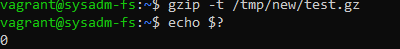
<br>

## Задание 16. Используя `pvmove`, переместите содержимое PV с RAID0 на RAID1.
```
sudo pvmove /dev/md1 /dev/md0
```
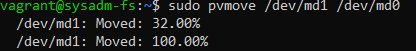
<br>

## Задание 17. Сделайте `--fail` на устройство в вашем RAID1 md.
```
sudo mdadm --fail /dev/md0 /dev/sdb1
```
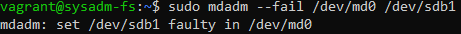
<br>

## Задание 18. Подтвердите выводом `dmesg`, что RAID1 работает в деградированном состоянии.
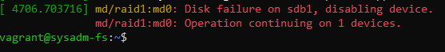
<br>

## Задание 19. Протестируйте целостность файла, несмотря на "сбойный" диск он должен продолжать быть доступен:
```
root@vagrant:~# gzip -t /tmp/new/test.gz
root@vagrant:~# echo $?
0
```
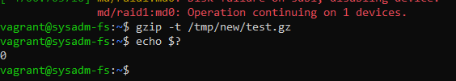
<br>

## Задание 20. Погасите тестовый хост, `vagrant destroy`.
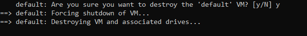
<br>