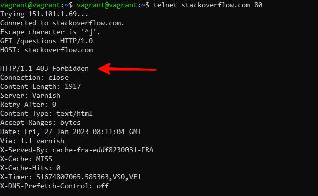

# Домашнее задание 03-sysadmin-06-net

<br>

## Задание 1. Работа c HTTP через телнет.
Подключитесь утилитой телнет к сайту stackoverflow.com
`telnet stackoverflow.com 80`

- Отправьте следующий HTTP запрос и в ответе укажите полученный HTTP код, что он означает?
```
GET /questions HTTP/1.0
HOST: stackoverflow.com
[press enter]
[press enter]
```

Отправил запрос:



В ответ получил: `HTTP/1.1 403 Forbidden` - стандартный код ответа HTTP, означающий, что доступ к запрошенному ресурсу запрещен.


<br>

## Задание 2. Повторите задание 1 в браузере, используя консоль разработчика F12.
- откройте вкладку `Network`
- отправьте запрос http://stackoverflow.com
- найдите первый ответ HTTP сервера, откройте вкладку `Headers`
- укажите в ответе полученный HTTP код
- проверьте время загрузки страницы, какой запрос обрабатывался дольше всего?
- приложите скриншот консоли браузера в ответ.<br>
<br>

Выполнил запрос и получил HTTP код: `307 Internal Redirect` - внутреннее перенаправление, в данном случае c HTTP на HTTPS соединение:


Дольше всего обрабатывался запрос подключения JS скриптов от Google Analytics:


<br>

## Задание 3. Какой IP адрес у вас в интернете?
Выполнил команду `curl http://ifconfig.me/ip`, мой **IP**: `95.59.219.67`


<br>

## Задание 4. Какому провайдеру принадлежит ваш IP адрес? Какой автономной системе AS? Воспользуйтесь утилитой `whois`

Выполнил команду `whois 95.59.219.67 | grep 'descr\|origin'`


<br>

## Задание 5. Через какие сети проходит пакет, отправленный с вашего компьютера на адрес 8.8.8.8? Через какие AS? Воспользуйтесь утилитой `traceroute`
Моя версия **traceroute** поддерживает параметр **-A**, который позволяет в вывод добавить AS.<br>

Выполнил команду `sudo traceroute 8.8.8.8 -A -i eth1`:


<br>

## Задание 6. Повторите задание 5 в утилите `mtr`. На каком участке наибольшая задержка - delay?
Выполнил команду `mtr -znwc 10 8.8.8.8 -I eth1`


Наибольшая задержка на 9 шаге.
<br>

## Задание 7. Какие DNS сервера отвечают за доменное имя dns.google? Какие A записи? Воспользуйтесь утилитой `dig`
Выполнил команду `dig NS dns.google`:


Выполнил команду `dig A dns.google`:


<br>

## Задание 8. Проверьте PTR записи для IP адресов из задания 7. Какое доменное имя привязано к IP? Воспользуйтесь утилитой `dig`
Выполнил команды:
```
dig -x 8.8.8.8
dig -x 8.8.4.4
```


<br>
