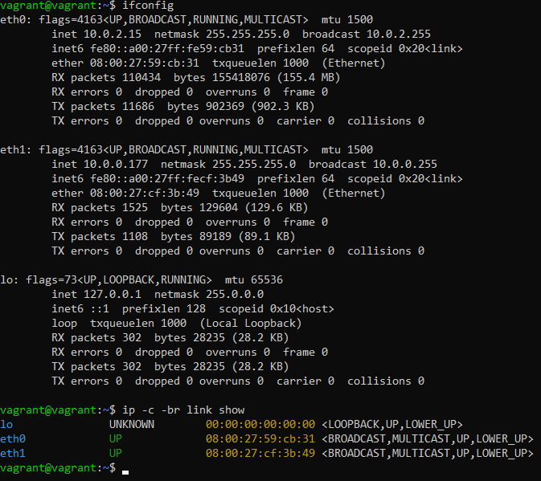
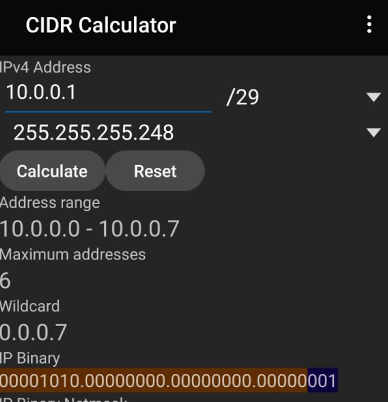

# Домашнее задание 03-sysadmin-07-net

<br>

## Задание 1. Проверьте список доступных сетевых интерфейсов на вашем компьютере. Какие команды есть для этого в Linux и в Windows?

Для Linux:
```
ifconfig
ip -c -br link show
```


Для Windows:
```
ipconfig
netsh interface show interface
```


<br>

## Задание 2. Какой протокол используется для распознавания соседа по сетевому интерфейсу? Какой пакет и команды есть в Linux для этого?
**LLDP (Link Layer Discovery Protocol)** - протокол канального уровня, который позволяет сетевым устройствам анонсировать в сеть информацию о себе и о своих возможностях, а также собирать эту информацию о соседних устройствах.<br>

Пакет называется `lldpd`, установить можно командой `sudo apt install lldpd`


<br>

## Задание 3. Какая технология используется для разделения L2 коммутатора на несколько виртуальных сетей? Какой пакет и команды есть в Linux для этого? Приведите пример конфига.
**VLAN (Virtual Local Area Network)** - виртуальная локальная компьютерная сеть. Представляет собой группу хостов с общим набором требований, которые взаимодействуют так, как если бы они были подключены к широковещательному домену независимо от их физического местонахождения.<br>

Существует разные типы VLAN (802.1Q, Port based VLAN и др.)<br>

Пакет называется `vlan`, установить можно командой `sudo apt install vlan`<br>

Пример конфигурации VLAN:

```
sudo ip link add link eth0 name eth0.vl-100 type vlan id 100
ip -c -br link sh
sudo ip addr add 192.168.0.10/24 brd 192.168.0.255 dev eth0.vl-100
ip -c -br addr sh
```

<br>

## Задание 4. Какие типы агрегации интерфейсов есть в Linux? Какие опции есть для балансировки нагрузки? Приведите пример конфига.
Агрегация сетевых интерфейсов в Linux осуществляется двумя типами: **горячий резерв** и **балансировка нагрузки**.<br>
<br>
При работе сетевых интерфейсов в режиме **горячего резерва** интерфейсы разделяются на ***основной*** и ***резервный***.<br>
<br>
Весь трафик, по умолчанию, направляется через основной интерфейс, запасной включается только в том случае, когда трафик не может быть направлен через основной (например не подключён сетевой кабель в основной интерфейс).<br>
<br>
В режиме **балансировка нагрузки** направление трафика устанавливается в зависимости от уровня приоритета, назначенного каждому интерфейсу.
<br>
- **mode=0 (balance-rr)** - при этом методе объединения трафик распределяется по принципу «карусели»: пакеты по очереди направляются на сетевые карты объединённого интерфейса. Например, если у нас есть физические интерфейсы eth0, eth1, and eth2, объединенные в bond0, первый пакет будет отправляться через eth0, второй — через eth1, третий — через eth2, а четвертый снова через eth0 и т.д.<br>
- **mode=1 (active-backup)** - когда используется этот метод, активен только один физический интерфейс, а остальные работают как резервные на случай отказа основного.<br>
- **mode=2 (balance-xor)** - в данном случае объединенный интерфейс определяет, через какую физическую сетевую карту отправить пакеты, в зависимости от MAC-адресов источника и получателя.<br>
- **mode=3 (broadcast)** - широковещательный режим, все пакеты отправляются через каждый интерфейс. Имеет ограниченное применение, но обеспечивает значительную отказоустойчивость.<br>
- **mode=4 (802.3ad)** - особый режим объединения. Для него требуется специально настраивать коммутатор, к которому подключен объединенный интерфейс. Реализует стандарты объединения каналов IEEE и обеспечивает как увеличение пропускной способности, так и отказоустойчивость.<br>
- **mode=5 (balance-tlb)** - распределение нагрузки при передаче. Входящий трафик обрабатывается в обычном режиме, а при передаче интерфейс определяется на основе данных о загруженности.<br>
- **mode=6 (balance-alb)** - адаптивное распределение нагрузки. Аналогично предыдущему режиму, но с возможностью балансировать также входящую нагрузку.<br>
<br>

Пример:
```
network:  
    renderer: networkd  
    version: 2  
    ethernets:  
        eth0:  
          dhcp4: no  
        eth1:  
          dhcp4: no  
    bonds:  
      bond0:  
        dhcp4: no  
        interfaces: [eth0, eth1]  
        parameters:  
          mode: 802.3ad  
          mii-monitor-interval: 1
```

Где:<br>

**bonds** - блок говорящий о том, что используется bonding<br>
**bond0** - произвольное имя интерфейса<br>
**interfaces** - набор интерфейсов собираемых в bonding<br>
**parameters** - блок настройки параметров<br>
**mode** - режим работы bonding<br>
**mii-monitor-interval** - интервал мониторинга 1 сек.<br>
<br>

## Задание 5. Сколько IP адресов в сети с маской /29 ? Сколько /29 подсетей можно получить из сети с маской /24. Приведите несколько примеров /29 подсетей внутри сети 10.10.10.0/24.

<br>

В сети с маской **/29** может быть 8 адресов: 1 - адрес сети, 6 - хостов, 1 - широковещательный адрес.<br>
<br>

В сети с маской **/24** может быть 32 сети с маской **/29**.<br>
<br>

Примеры **/29** подсетей внутри сети **10.10.10.0/24**:


<br>

## Задание 6. Задача: вас попросили организовать стык между 2-мя организациями. Диапазоны 10.0.0.0/8, 172.16.0.0/12, 192.168.0.0/16 уже заняты. Из какой подсети допустимо взять частные IP адреса? Маску выберите из расчета максимум 40-50 хостов внутри подсети.
Можно взять из диапазона **Carrier-Grade NAT**:
```
100.64.0.0 — 100.127.255.255 (маска подсети: 255.192.0.0 или /10)
```

Для расчета сети с 40-50 хостами использовал консольную утилиту **ipcalc**, выполнил команду:
```
ipcalc -b 100.100.0.0 -s 45
```

<br>

## Задание 7. Как проверить ARP таблицу в Linux, Windows? Как очистить ARP кеш полностью? Как из ARP таблицы удалить только один нужный IP?
Проверить ARP таблицу в Linux и Windows можно командой:
```
arp -a
```

Очистить ARP кеш в Linux можно командой:
```
sudo ip -s neigh flush all
```

Очистить ARP кеш в Windows можно командой:
```
netsh interface ip delete arpcache
```

Удалить один нужный IP из ARP таблицы в Linux:
```
sudo arp -d 192.168.0.50
```

Удалить один нужный IP из ARP таблицы в Windows:
```
arp -d 192.168.0.50
```
<br>


