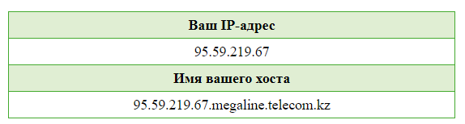
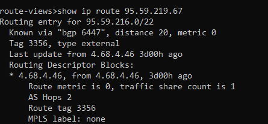
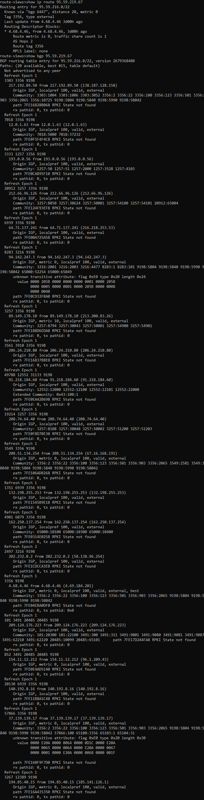
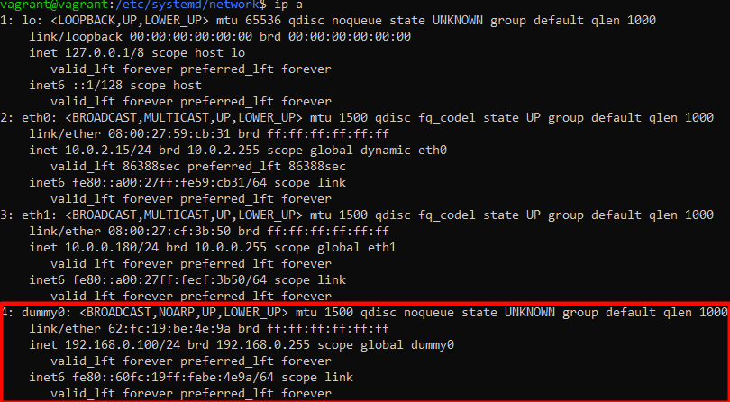
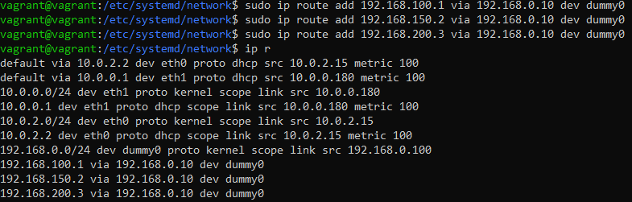
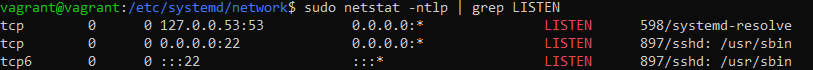
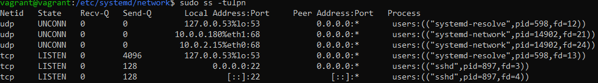
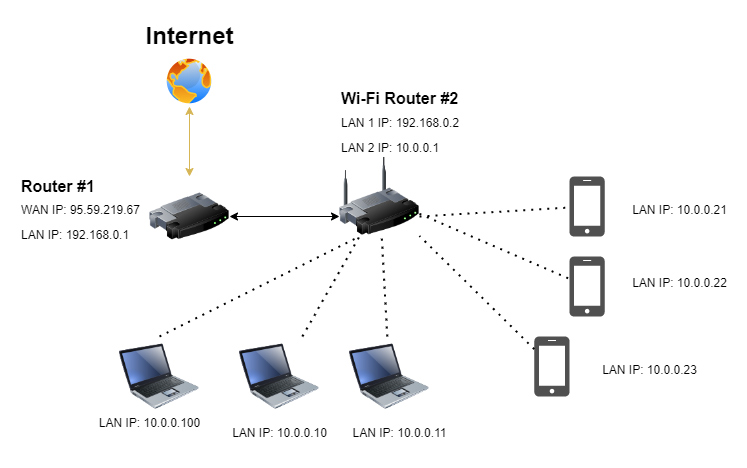

# Домашнее задание 03-sysadmin-08-net

<br>

## Задание 1. Подключитесь к публичному маршрутизатору в интернет. Найдите маршрут к вашему публичному IP
```
telnet route-views.routeviews.org
Username: rviews
show ip route x.x.x.x/32
show bgp x.x.x.x/32
```

Мой публичный IP: **95.59.219.67**<br>



Подключаемся к публичному маршрутизатору и выполняем команду `show ip route 95.59.219.67`:<br>



Затем выполняем команду `show bgp 95.59.219.67`:<br>


<br>

## Задание 2. Создайте dummy0 интерфейс в Ubuntu. Добавьте несколько статических маршрутов. Проверьте таблицу маршрутизации.

Создаем **dummy0** интерфейс в Ubuntu:
```
sudo modprobe -v dummy
sudo ip link add name dummy0 type dummy
```

Пропишем настройки в файлах **/etc/systemd/network/dummy0.network** и **/etc/systemd/network/dummy0.netdev**
```
sudo touch /etc/systemd/network/dummy0.network
sudo touch /etc/systemd/network/dummy0.netdev
```

Добавим в **/etc/systemd/network/dummy0.network**:
```
[Match]
Name=dummy0
[Network]
Address=192.168.0.10
Mask=255.255.255.0
```

Добавим в **/etc/systemd/network/dummy0.netdev**:
```
[NetDev]
Name=dummy0
Kind=dummy
```

Перезапустим сетевой демон и проверим результат:
```
sudo systemctl restart systemd-networkd
```

<br>

Добавляем несколько статических маршрутов:
```
sudo ip route add 192.168.100.1 via 192.168.0.10 dev dummy0
sudo ip route add 192.168.150.2 via 192.168.0.10 dev dummy0
sudo ip route add 192.168.200.3 via 192.168.0.10 dev dummy0
```

<br>

## Задание 3. Проверьте открытые TCP порты в Ubuntu, какие протоколы и приложения используют эти порты? Приведите несколько примеров.

Для проверки используем утилиту **netstat**, если утилита не установлена, то сперва устанавливаем:
```
sudo apt install net-tools
sudo netstat -ntlp | grep LISTEN
```

<br>
Порт **53/TCP** используется подсистемой **DNS**, демоном **systemd-resolved**.<br>
Порт **22/TCP** используется демоном **sshd**.
<br>

## Задание 4. Проверьте используемые UDP сокеты в Ubuntu, какие протоколы и приложения используют эти порты?

Для проверки используем утилиту **ss**:
```
sudo ss -tulpn
```

<br>
Порт **53/UDP** используется подсистемой **DNS**, демоном **systemd-resolved**.<br>
Порт **68/UDP** используется службой **dhclient**.
<br>

## Задание 5. Используя diagrams.net, создайте L3 диаграмму вашей домашней сети или любой другой сети, с которой вы работали.

<br>


