# Домашнее задание 03-sysadmin-08-net

<br>

## Задание 1. Установите Bitwarden плагин для браузера. Зарегестрируйтесь и сохраните несколько паролей.
Плагин для браузера установил, несколько паролей сохранил.<br><br>
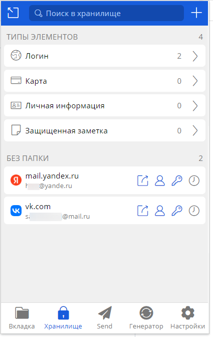
<br>

## Задание 2. Установите Google authenticator на мобильный телефон. Настройте вход в Bitwarden акаунт через Google authenticator OTP.
Установил Google authenticator, включил 2FA.<br><br>
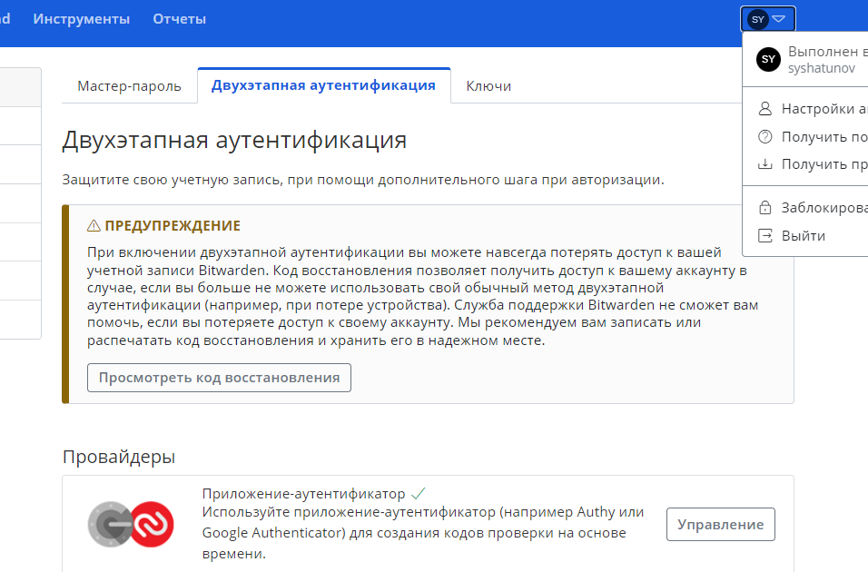
<br>

## Задание 3. Установите apache2, сгенерируйте самоподписанный сертификат, настройте тестовый сайт для работы по HTTPS.
На своих Web-серверах я использую связку Apache2 + Nginx, HTTPS настроен на Nginx, панель управления ISPmanager с индивидуальными оптимизациями, оценка по сайту [SSLabs](https://www.ssllabs.com/ssltest/analyze.html) **A+** на валидных сертификатах.<br>
<br>
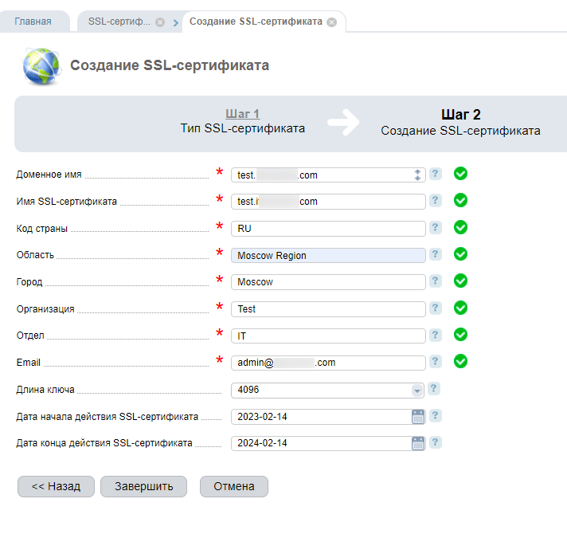
<br>

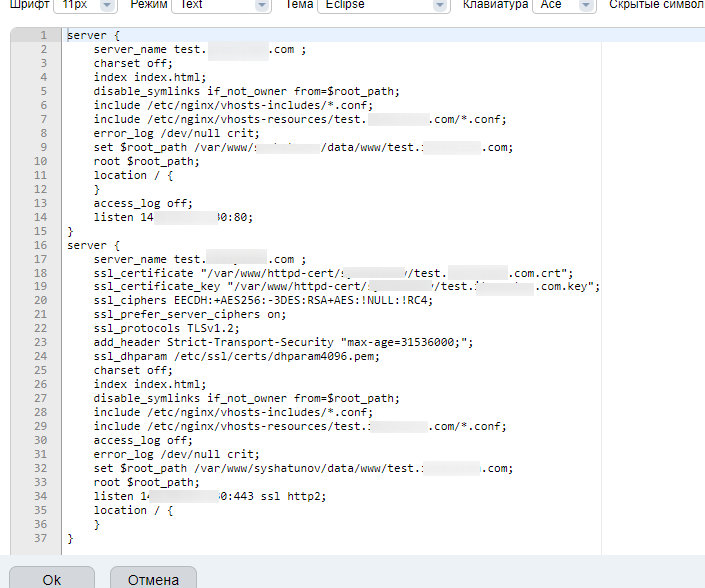
<br>

## Задание 4. Проверьте на TLS уязвимости произвольный сайт в интернете (кроме сайтов МВД, ФСБ, МинОбр, НацБанк, РосКосмос, РосАтом, РосНАНО и любых госкомпаний, объектов КИИ, ВПК ... и тому подобное).
Скачал утилиту **testssl.sh** для поиска TLS уязвимостей и проверил сайт Нетологии:<br>

```
wget https://github.com/drwetter/testssl.sh/archive/refs/tags/v3.0.8.tar.gz
v3.0.8.tar.gz
tar -zxvf v3.0.8.tar.gz && cd testssl.sh-3.0.8
./testssl.sh -U --parallel https://netology.ru
```

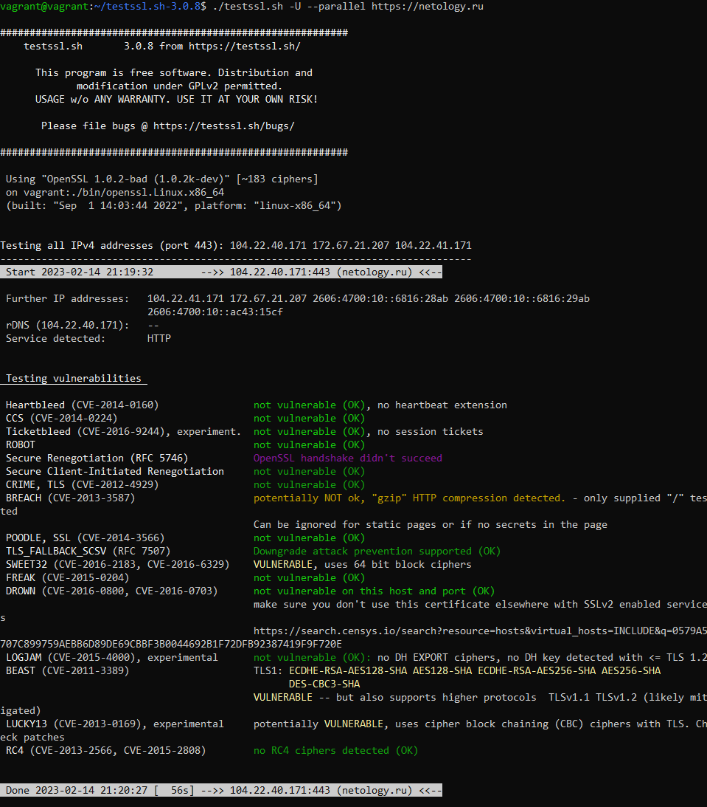
<br>

## Задание 5. Установите на Ubuntu ssh сервер, сгенерируйте новый приватный ключ. Скопируйте свой публичный ключ на другой сервер. Подключитесь к серверу по SSH-ключу.
Установил SSH-сервер используя команду:
```
sudo apt install openssh-server
```

Сгенерировал новый приватный ключ:
```
ssh-keygen -f ~/.ssh/test
```
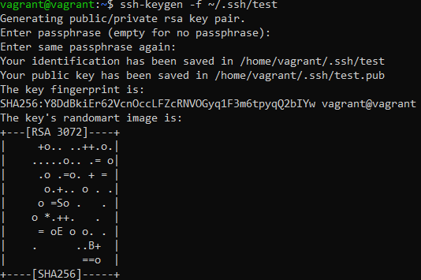

Скопировал публичный ключ на другой сервер:
```
ssh-copy-id -i ~/.ssh/test.pub administrator@172.27.231.189
```
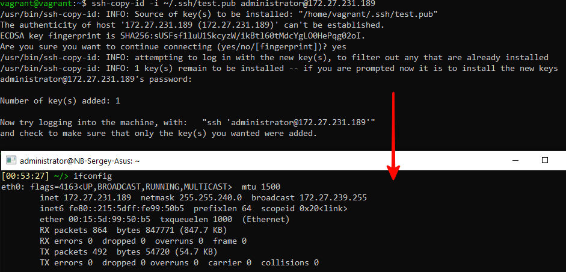

Протестировал подключение к другому серверу по SSH-ключу:

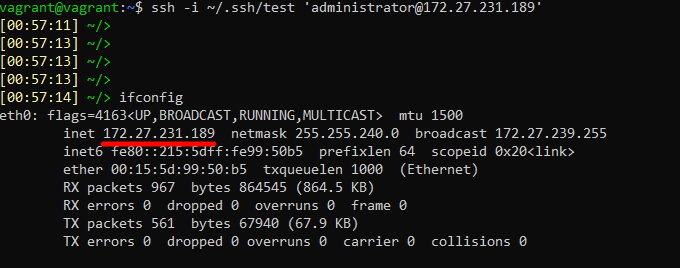
<br>

## Задание 6. Переименуйте файлы ключей из задания 5. Настройте файл конфигурации SSH клиента, так чтобы вход на удаленный сервер осуществлялся по имени сервера.
Переименовал файлы ключей:
```
mv ~/.ssh/test ~/.ssh/test_new
mv ~/.ssh/test.pub ~/.ssh/test_new.pub
```

Задал настройки в **~/.ssh/config**:
```
Host comp2
User administrator
HostName 172.27.231.189
Port 22
IdentityFile ~/.ssh/test_new
```
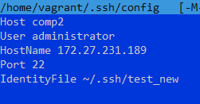
<br>

Подключился по имени сервера:
```
ssh comp2
```
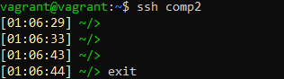

## Задание 7. Соберите дамп трафика утилитой tcpdump в формате pcap, 100 пакетов. Откройте файл pcap в Wireshark.
Собрал дамп трафика:
```
tcpdump -i eth1 -c 100 -w ~/tcpdump.pcap
```
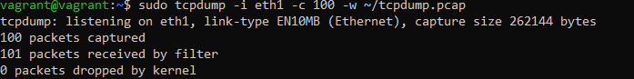

Открыл файл pcap в Wireshark:<br><br>
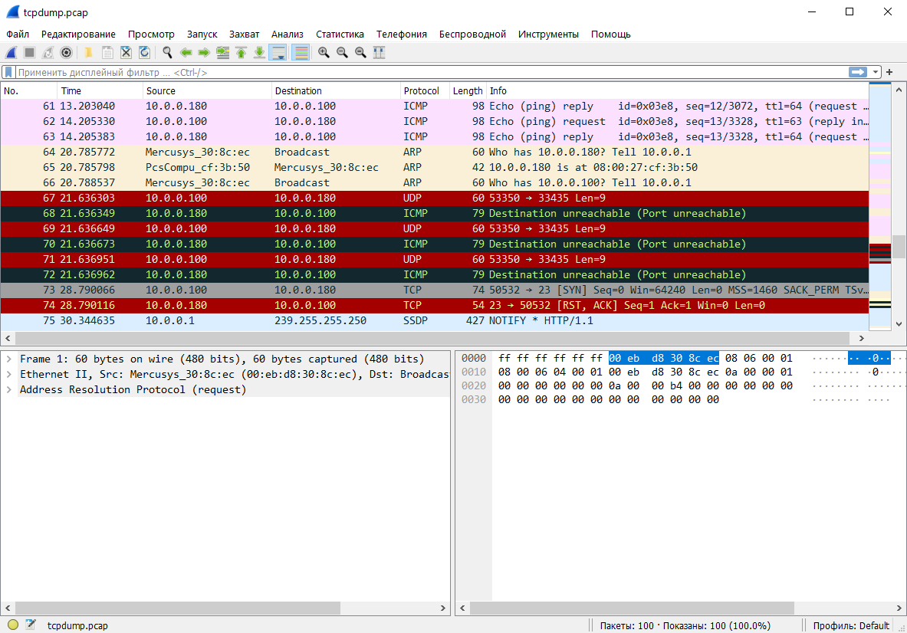

<br>


