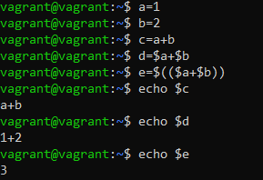

# Домашнее задание 04-script-01-bash

<br>

## Задание 1
Есть скрипт:
```bash
a=1
b=2
c=a+b
d=$a+$b
e=$(($a+$b))
```

Какие значения переменным c, d, e будут присвоены? Почему?

### Решение

| Переменная | Значение  | Обоснование                                                                                                                                                               |
|------------|-----------|---------------------------------------------------------------------------------------------------------------------------------------------------------------------------|
| `c`        | a+b       | `a` и `b` указаны без знака **$**, Bash считает их не переменными, а просто текстом                                                                                       |
| `d`        | 1+2       | Указан **$** перед переменными `a` и `b`, поэтому Bash выводит их значение, но сложения не происходит, т.к. эти переменные заданы в неявном виде и являются сроками       |
| `e`        | 3         | Происходил арифметическое сложение, т.к. используются знак **$** и скобки `((`, `))` для экранирования лишних символов и преобразования значений переменных в целые числа |


<br>


## Задание 2
На нашем локальном сервере упал сервис, и мы написали скрипт, который постоянно проверяет его доступность, записывая дату проверок до тех пор, пока сервис не станет доступным. После чего скрипт должен завершиться.<br><br>
В скрипте допущена ошибка, из-за которой выполнение не может завершиться, при этом место на жёстком диске постоянно уменьшается. Что необходимо сделать, чтобы его исправить:

```bash
while ((1==1)
do
	curl https://localhost:4757
	if (($? != 0))
	then
		date >> curl.log
	fi
done
```

### Решение
```bash
while ((1==1)
do
	curl https://localhost:4757
	if (($? != 0))
	then
		date > curl.log
	else
		exit
	fi
done
```
<br>


## Задание 3
Необходимо написать скрипт, который проверяет доступность трёх IP: `192.168.0.1`, `173.194.222.113`, `87.250.250.242` по `80` порту и записывает результат в файл `log`. Проверять доступность необходимо пять раз для каждого узла.

### Решение
```bash
#!/bin/bash

array=(192.168.0.1 173.194.222.113 87.250.250.242)
i=5
while (($i > 0))
do
	for j in ${array[@]}
	do
		nc -zvw3 $j 80 2>>log
	done
	let "i -= 1"
done
```
<br>


## Задание 4
Необходимо дописать скрипт из предыдущего задания так, чтобы он выполнялся до тех пор, пока один из узлов не окажется недоступным. Если любой из узлов недоступен — IP этого узла пишется в файл error, скрипт прерывается.

### Решение
```bash
#!/bin/bash

array=(192.168.0.1 173.194.222.113 87.250.250.242)
i=5
while (($i > 0))
do
	for j in ${array[@]}
	do
		nc -zvw3 $j 80 2>>log
		if (($? != 0))
		then
			echo $j > error
			exit
		fi
	done
	let "i -= 1"
done
```
<br>


