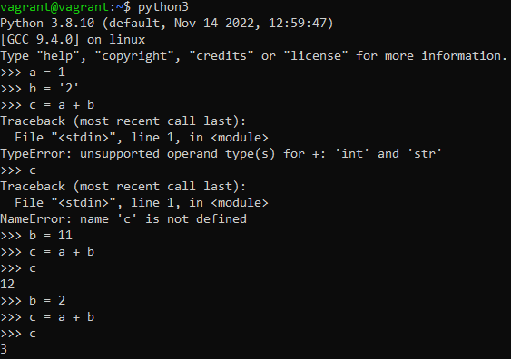
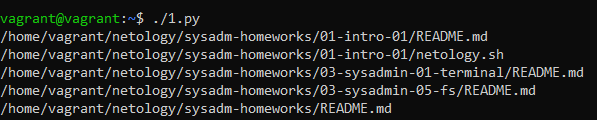
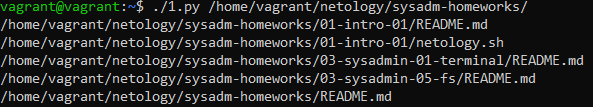
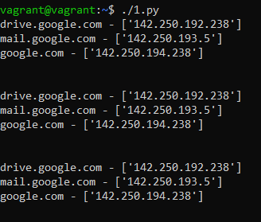

# Домашнее задание 04-script-02-py

<br>

## Задание 1
Есть скрипт:
```python
#!/usr/bin/env python3
a = 1
b = '2'
c = a + b
```
<br>

| Вопрос  | Ответ                                                                                                                                                                          |
| ------------- |--------------------------------------------------------------------------------------------------------------------------------------------------------------------------------|
| Какое значение будет присвоено переменной `c`?  | **TypeError**: unsupported operand type(s) for +: 'int' and 'str'<br>**NameError**: name 'с' is not defined<br>Получили ошибки, т.к. у переменных `a` и `b` разные типы данных |
| Как получить для переменной `c` значение 12?  | Необходимо присвоить переменной `b` числовое значение 11, и выполнить заново `c = a + b`                                                                                       |
| Как получить для переменной `c` значение 3?  | Необходимо присвоить переменной `b` числовое значение 2, и выполнить заново `c = a + b`                                                                                        |


<br>

## Задание 2
Мы устроились на работу в компанию, где раньше уже был DevOps-инженер. Он написал скрипт, позволяющий узнать, какие файлы модифицированы в репозитории относительно локальных изменений. Этим скриптом недовольно начальство, потому что в его выводе есть не все изменённые файлы, а также непонятен полный путь к директории, где они находятся.<br><br>
Как можно доработать скрипт ниже, чтобы он исполнял требования вашего руководителя?
```python
#!/usr/bin/env python3

import os

bash_command = ["cd ~/netology/sysadm-homeworks", "git status"]
result_os = os.popen(' && '.join(bash_command)).read()
is_change = False
for result in result_os.split('\n'):
    if result.find('modified') != -1:
        prepare_result = result.replace('\tmodified:   ', '')
        print(prepare_result)
        break
```

### Решение
```python
#!/usr/bin/env python3

import os

repo_path="/home/vagrant/netology/sysadm-homeworks/"

bash_command = ["cd " + repo_path, "git status"]
result_os = os.popen(' && '.join(bash_command)).read()

for result in result_os.split('\n'):
        if result.find('modified') != -1:
            prepare_result = result.replace('\tmodified:   ', '')
            print(repo_path + prepare_result)
```


<br>


## Задание 3
Доработать скрипт выше так, чтобы он не только мог проверять локальный репозиторий в текущей директории, но и умел воспринимать путь к репозиторию, который мы передаём, как входной параметр. Мы точно знаем, что начальство будет проверять работу этого скрипта в директориях, которые не являются локальными репозиториями.

### Решение
```python
#!/usr/bin/env python3

import os
import sys

repo_path=sys.argv[1]

if not os.path.exists(repo_path + '/.git'):
    print("This is not a repository")
    sys.exit()

path_var=f'cd {repo_path}'

bash_command = [path_var, "git status"]
result_os = os.popen(' && '.join(bash_command)).read()

for result in result_os.split('\n'):
        if result.find('modified') != -1:
            prepare_result = result.replace('\tmodified:   ', '')
            print(repo_path + prepare_result)
```


<br>


## Задание 4
Наша команда разрабатывает несколько веб-сервисов, доступных по HTTPS. Мы точно знаем, что на их стенде нет никакой балансировки, кластеризации, за DNS прячется конкретный IP сервера, где установлен сервис. 

Проблема в том, что отдел, занимающийся нашей инфраструктурой, очень часто меняет нам сервера, поэтому IP меняются примерно раз в неделю, при этом сервисы сохраняют за собой DNS-имена. Это бы совсем никого не беспокоило, если бы несколько раз сервера не уезжали в такой сегмент сети нашей компании, который недоступен для разработчиков. 

Мы хотим написать скрипт, который: 

- опрашивает веб-сервисы; 
- получает их IP; 
- выводит информацию в стандартный вывод в виде: <URL сервиса> - <его IP>. 

Также должна быть реализована возможность проверки текущего IP сервиса c его IP из предыдущей проверки. Если проверка будет провалена — оповестить об этом в стандартный вывод сообщением: [ERROR] <URL сервиса> IP mismatch: <старый IP> <Новый IP>. Будем считать, что наша разработка реализовала сервисы: `drive.google.com`, `mail.google.com`, `google.com`.

### Решение
```python
#!/usr/bin/env python3

import os
import sys
import socket
import time

dict_service = {"drive.google.com": "0", "mail.google.com": "0", "google.com": "0"}

while True:
    for i in dict_service.keys():
        oldIP = dict_service[i]
        newIP = socket.gethostbyname_ex(i)[2]

        if oldIP != newIP and oldIP != "0":
            print(f'[ERROR] {i} IP mismatch: {oldIP} {newIP}')
        else:
            print(f'{i} - {newIP}')
            dict_service[i] = newIP
    print('\n')
    time.sleep(2)
```


<br>
