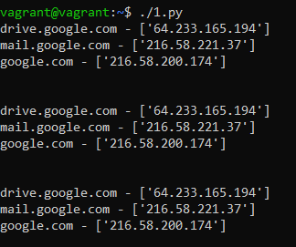

# Домашнее задание 04-script-03-yaml

<br>

## Задание 1
Мы выгрузили JSON, который получили через API-запрос к нашему сервису:
```
    { "info" : "Sample JSON output from our service\t",
        "elements" :[
            { "name" : "first",
            "type" : "server",
            "ip" : 7175 
            }
            { "name" : "second",
            "type" : "proxy",
            "ip : 71.78.22.43
            }
        ]
    }
```

Нужно найти и исправить все ошибки, которые допускает наш сервис.

### Решение

```
???
```


<br>


## Задание 2

В прошлый рабочий день мы создавали скрипт, позволяющий опрашивать веб-сервисы и получать их IP. К уже реализованному функционалу нам нужно добавить возможность записи JSON и YAML-файлов, описывающих наши сервисы. 

Формат записи JSON по одному сервису: `{ "имя сервиса" : "его IP"}`. 

Формат записи YAML по одному сервису: `- имя сервиса: его IP`. 

Если в момент исполнения скрипта меняется IP у сервиса — он должен так же поменяться в YAML и JSON-файле.

### Решение

```
```python
???
```

#### Вывод скрипта при запуске во время тестирования:

```
???
```

#### JSON-файл(ы), который(е) записал ваш скрипт:

```json
???
```

#### YAML-файл(ы), который(е) записал ваш скрипт:

```yaml
???
```
<br>
