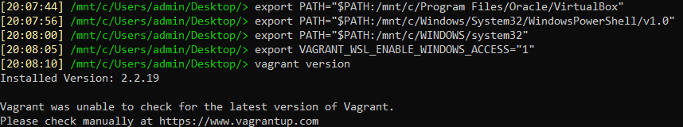

# Домашнее задание 05-virt-02-iaac

<br>

## Задание 1
### Опишите основные преимущества применения на практике IaaC-паттернов.
К основным преимуществам можно отнести:
- Оптимизация и ускорение времени предоставления инфраструктуры для разработки и тестирования.
- Устранение дрейфа конфигураций и стабильность среды.
- Более быструю разработку и тестирование продуктов.

### Какой из принципов IaaC является основополагающим?
Основополагающим принципом является принцип **идемпотентности**.<br><br>
**Идемпотентность** – это свойство объекта или операции, при повторном выполнении которой мы получаем результат идентичный предыдущему и всем последующим выполнениям.
<br>

## Задание 2
### Чем Ansible выгодно отличается от других систем управление конфигурациями?
К основным преимуществам можно отнести:
- Простота настройки и использования.
- Используется YAML язык для описания конфигурации.
- Используется декларативный подход.
- Использует push модель доставки (без агентов). Меньше рисков безопасности.
- Легко масштабируется.
- Легко обеспечить высокую доступность (поддерживаются резервные серверы).

### Какой, на ваш взгляд, метод работы систем конфигурации более надёжный — push или pull?
По моему мнению, оба метода являются надежными, разница состоит лишь в том, кто инициирует соединение.
<br>

## Задание 3
Установите на личный компьютер: VirtualBox, Vagrant, Terraform, Ansible. Приложите вывод команд установленных версий каждой из программ, оформленный в Markdown.<br>

### VirtualBox
```
Добавить в системную переменную Path: C:\Program Files\Oracle\VirtualBox\
VBoxManage -version
```

<br>

### Vagrant
```
sudo -i
wget -q -O /usr/share/keyrings/hashicorp.key https://apt.releases.hashicorp.com/gpg
echo "deb [signed-by=/usr/share/keyrings/hashicorp.key] https://apt.releases.hashicorp.com $(lsb_release -cs) main" | tee -a /etc/apt/sources.list.d/hashicorp.list
apt update
apt install vagrant
exit
export PATH="$PATH:/mnt/c/Program Files/Oracle/VirtualBox"
export PATH="$PATH:/mnt/c/Windows/System32/WindowsPowerShell/v1.0"
export PATH="$PATH:/mnt/c/WINDOWS/system32"
export VAGRANT_WSL_ENABLE_WINDOWS_ACCESS="1"

vagrant version
```

<br>

### Terraform
```
sudo -i
wget -q -O /usr/share/keyrings/hashicorp.key https://apt.releases.hashicorp.com/gpg
echo "deb [signed-by=/usr/share/keyrings/hashicorp.key] https://apt.releases.hashicorp.com $(lsb_release -cs) main" | tee -a /etc/apt/sources.list.d/hashicorp.list
apt update
apt install terraform
exit

terraform -version
```

<br>

### Ansible
```
sudo -i
pip3 install ansible
exit

ansible --version
```

<br>
<br>


## Задание 4
Воспроизведите практическую часть лекции самостоятельно.
- Создайте виртуальную машину.
- Зайдите внутрь ВМ, убедитесь, что Docker установлен с помощью команды `docker ps`


### Т.к. задания выполнялись на Windows 10 + WSL необходимы были дополнительные манипуляции
```
cd /mnt/c/Users/admin/Desktop/05-virt-02-iaac/src/vagrant/
export VAGRANT_WSL_WINDOWS_ACCESS_USER_HOME_PATH="/mnt/c/Users/admin/Desktop/05-virt-02-iaac/src/"
```
Создать файл **/etc/wsl.conf** со следующим содержимым и перезапустить WSL:
```
# Enable extra metadata options by default
[automount]
enabled = true
root = /mnt/
options = "metadata,umask=77,fmask=11"
mountFsTab = false
```
В файле **./ansible/inventory** изменен IP с 127.0.0.1 на 172.22.96.1
```
vagrant box add bento/ubuntu-20.04 "/mnt/c/Users/admin/Desktop/05-virt-02-iaac/src/vagrant/3a63bfcc-1339-4c83-abb1-7badc1fd574e"
vagrant plugin install virtualbox_WSL2 --plugin-clean-sources --plugin-source https://rubygems.org
vagrant up --provider virtualbox
vagrant ssh
```


<br>


<br>
<br>