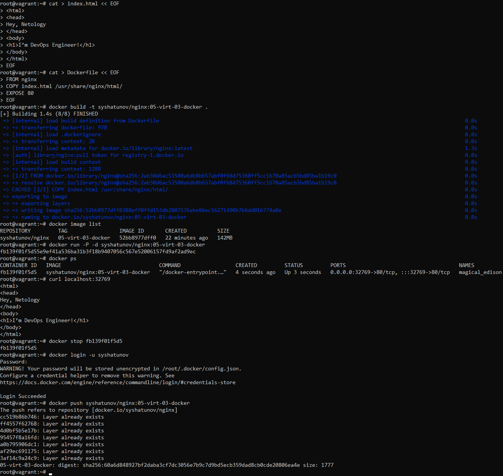
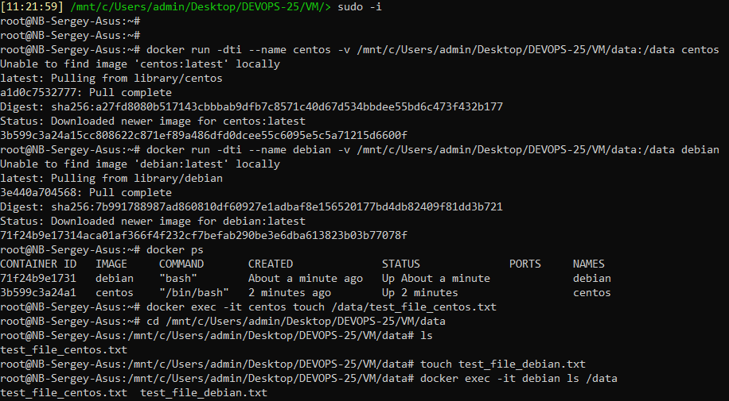

# Домашнее задание 05-virt-03-docker

<br>

## Задание 1
Зарегистрировался на сайте https://hub.docker.com, создал свой репозиторий https://hub.docker.com/r/syshatunov/nginx. <br><br>
Создал Fork образа веб-сервера Nginx, с кастомной индекс-страницей:
```
sudo -i
cd ~

cat > index.html << EOF
<html>
<head>
Hey, Netology
</head>
<body>
<h1>I’m DevOps Engineer!</h1>
</body>
</html>
EOF

cat > Dockerfile << EOF
FROM nginx
COPY index.html /usr/share/nginx/html/
EXPOSE 80
EOF

docker build -t syshatunov/nginx:05-virt-03-docker .
docker image list
docker run -P -d syshatunov/nginx:05-virt-03-docker
docker ps
curl localhost:32769
docker stop fb139f01f5d5
docker login -u syshatunov
docker push syshatunov/nginx:05-virt-03-docker
```

<br>

## Задание 2
Посмотрите на сценарий ниже и ответьте на вопрос:
«Подходит ли в этом сценарии использование Docker-контейнеров или лучше подойдёт виртуальная машина, физическая машина? Может быть, возможны разные варианты?»

Детально опишите и обоснуйте свой выбор.

**Сценарий:**
- **Высоконагруженное монолитное Java веб-приложение**. Виртуальная машина, она позволит запускать приложение быстрее чем физическая, кроме этого даст возможность использовать живую миграцию и создавать снепшоты, а так же будет возможность динамически изменять ресурсы доступные приложению (процессор, память). Контейнер не подойдёт из-за высокой нагрузки, кроме этого приложение монолитное и в контейнеры его упаковать бывает сложно.
- **Nodejs веб-приложение**. Подойдет Docker, так как позволяет проводить быструю разработку и тестирование приложений.
- **Мобильное приложение c версиями для Android и iOS**. Виртуальные машины или Docker контейнеры, они позволят получить достаточный уровень производительности и масштабируемости. Использование физической машины может быть не оправдано, т.к при малом числе пользователей оборудование будет простаивать, а при большом числе пользователей физическая машина не даст нужного уровня гибкости.
- **Шина данных на базе Apache Kafka**. Виртуальные машины, для Apache Kafka нужен достаточный уровень производительности системы и возможность сохранять состояние сервиса. Физическая машина не позволит создать снепшоты состояния системы. Для задач в которых не требуется хранить состояние Apache Kafka или не требуется высокая надёжность могут подойти контейнеры.
- **Elasticsearch-кластер для реализации логирования продуктивного веб-приложения — три ноды elasticsearch, два logstash и две ноды kibana**. Виртуальные машины, т.к. необходимо подготовить кластер, который сможет в режиме реального времени обрабатывать логи приложений. Его лучше разворачивать на ресурсах, способных выдержать необходимую нагрузку.
- **Мониторинг-стек на базе Prometheus и Grafana**. Docker контейнеры, это позволит быстро подготавливать новые ноды. 
- **MongoDB как основное хранилище данных для Java-приложения**. Виртуальные машины, чтобы использовать надёжную систему, позволяющую записывать большое число событий.
- **Gitlab-сервер для реализации CI/CD-процессов и приватный (закрытый) Docker Registry**. Виртуальные машины или Docker-контейнеры. Запуск пайплайнов CI/CD уже адаптированы для запуска в контейнерах.
<br>

## Задание 3
- Запустите первый контейнер из образа ***centos*** c любым тегом в фоновом режиме, подключив папку ```/data``` из текущей рабочей директории на хостовой машине в ```/data``` контейнера.
- Запустите второй контейнер из образа ***debian*** в фоновом режиме, подключив папку ```/data``` из текущей рабочей директории на хостовой машине в ```/data``` контейнера.
- Подключитесь к первому контейнеру с помощью ```docker exec``` и создайте текстовый файл любого содержания в ```/data```.
- Добавьте ещё один файл в папку ```/data``` на хостовой машине.
- Подключитесь во второй контейнер и отобразите листинг и содержание файлов в ```/data``` контейнера.

```
sudo -i

docker run -dti --name centos -v /mnt/c/Users/admin/Desktop/DEVOPS-25/VM/data:/data centos
docker run -dti --name debian -v /mnt/c/Users/admin/Desktop/DEVOPS-25/VM/data:/data debian
docker ps
docker exec -it centos touch /data/test_file_centos.txt
cd /mnt/c/Users/admin/Desktop/DEVOPS-25/VM/data
ls
touch test_file_debian.txt
docker exec -it debian ls /data
```

<br>


