# Домашнее задание 05-virt-04-docker-compose

<br>

## Задание 1
Создайте собственный образ любой операционной системы (например ubuntu-20.04) с помощью Packer ([инструкция](https://cloud.yandex.ru/docs/tutorials/infrastructure-management/packer-quickstart)).<br>

#### Установил Packer:
```
sudo -i
wget -q -O /usr/share/keyrings/hashicorp.key https://apt.releases.hashicorp.com/gpg
echo "deb [signed-by=/usr/share/keyrings/hashicorp.key] https://apt.releases.hashicorp.com $(lsb_release -cs) main" | tee -a /etc/apt/sources.list.d/hashicorp.list
apt update
apt install packer
exit
```
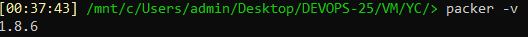

#### Установил интерфейс командной строки Yandex Cloud (CLI) и настроил профиль:
```
curl -sSL https://storage.yandexcloud.net/yandexcloud-yc/install.sh | bash
yc init
yc config list
```
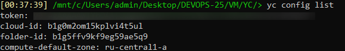

#### Cоздал кастомный образ ОС на основе конфигурационного файла Packer:
```
packer build centos-7-base.json
yc compute image list
```
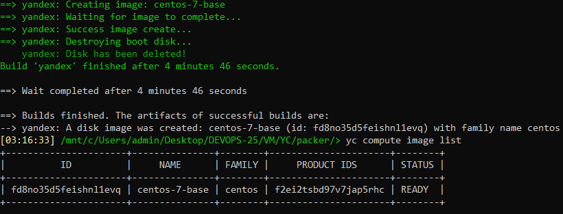
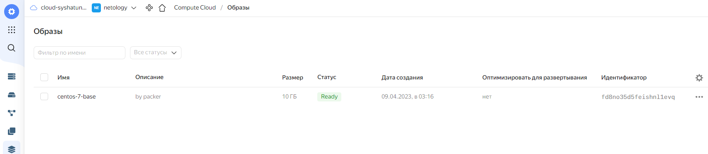

## Задание 2
**2.1.** Создайте вашу первую виртуальную машину в YandexCloud с помощью web-интерфейса YandexCloud.        

**2.2.*** **(Необязательное задание)**
Создайте вашу первую виртуальную машину в YandexCloud с помощью Terraform (вместо использования веб-интерфейса YandexCloud).
Используйте Terraform-код в директории ([src/terraform](https://github.com/netology-group/virt-homeworks/tree/virt-11/05-virt-04-docker-compose/src/terraform)).<br>

#### Создал сервисный аккаунт YandexCloud с админскими правами для Terraform:
```
yc iam service-account create --name sa-netology-terraform --folder-id b1g5ffv9kf9eg59ae5q9
yc resource-manager folder add-access-binding netology --role admin --subject serviceAccount:aje467lq3lbjvrqdujq8
yc iam key create --service-account-name sa-netology-terraform --output key.json
```
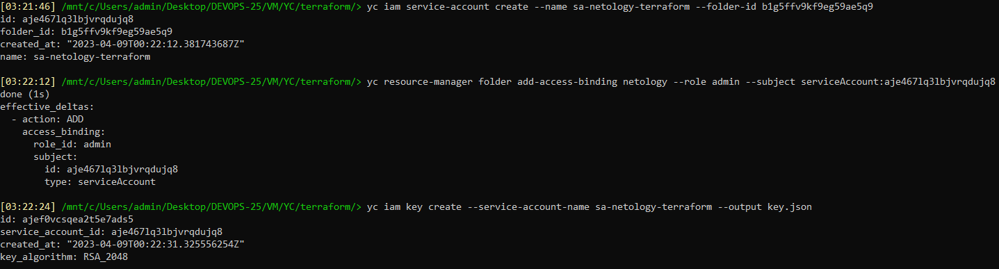

#### Создал VM используя Terraform и свой кастомный образ ОС:
```
terraform init
terraform plan
terraform apply
```
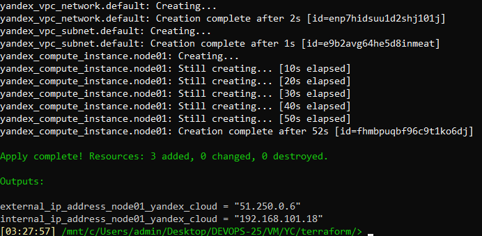

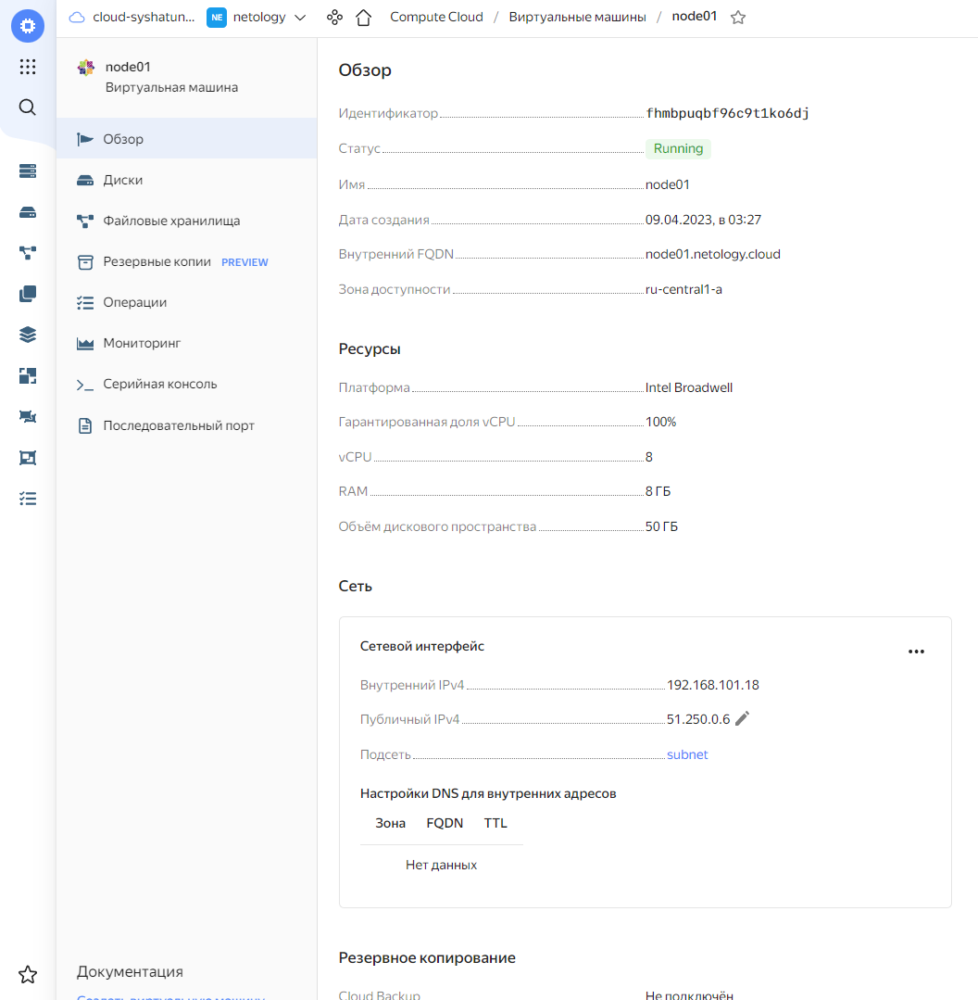

## Задание 3
С помощью Ansible и Docker Compose разверните на виртуальной машине из предыдущего задания систему мониторинга на основе Prometheus/Grafana.
Используйте Ansible-код в директории ([src/ansible](https://github.com/netology-group/virt-homeworks/tree/virt-11/05-virt-04-docker-compose/src/ansible)).<br><br>
Чтобы получить зачёт, вам нужно предоставить вывод команды "docker ps" , все контейнеры, описанные в [docker-compose](https://github.com/netology-group/virt-homeworks/blob/virt-11/05-virt-04-docker-compose/src/ansible/stack/docker-compose.yaml),  должны быть в статусе "Up".<br><br>

#### В файле **ansible/inventory** добавляем адрес сервера `ansible_host=51.250.0.6` и выполняем команду:
```
ansible-playbook provision.yml
```
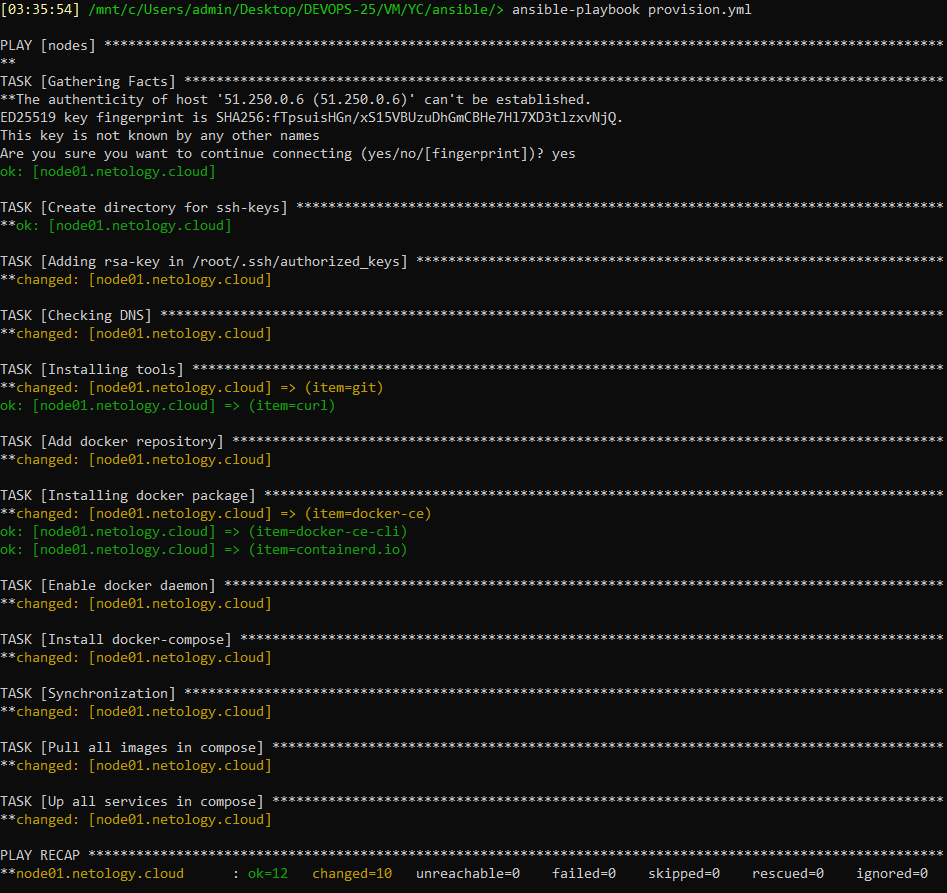

#### Подключаемся к виртуальной машине и проверяем запущенные контейнеры:
```
ssh root@51.250.0.6
docker ps
```
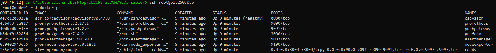


## Задание 4
1. Откройте веб-браузер, зайдите на страницу http://<внешний_ip_адрес_вашей_ВМ>:3000.
2. Используйте для авторизации логин и пароль из [.env-file](https://github.com/netology-group/virt-homeworks/blob/virt-11/05-virt-04-docker-compose/src/ansible/stack/.env).
3. Изучите доступный интерфейс, найдите в интерфейсе автоматически созданные docker-compose-панели с графиками([dashboards](https://grafana.com/docs/grafana/latest/dashboards/use-dashboards/)).
4. Подождите 5-10 минут, чтобы система мониторинга успела накопить данные.

#### Перешел по адресу http://51.250.0.6:3000 и проверил показатели в Grafana:
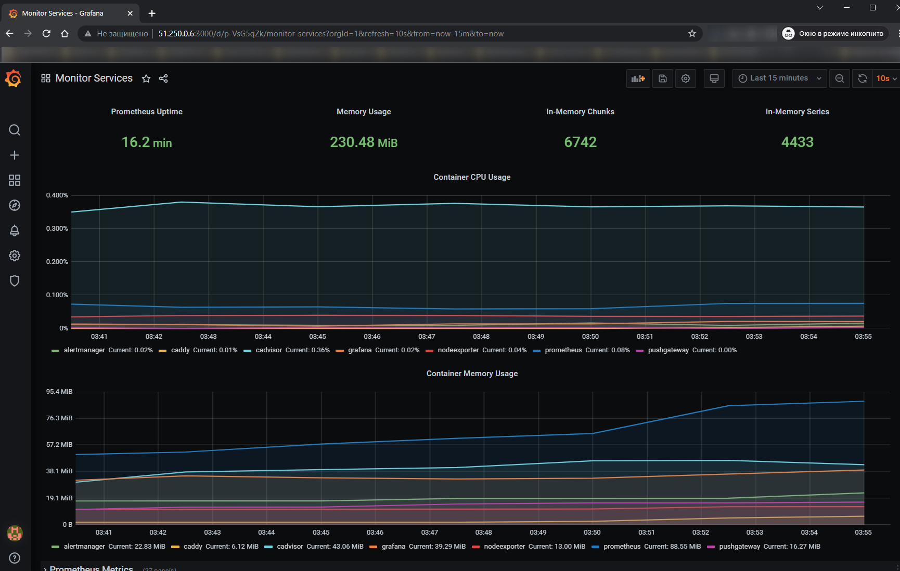

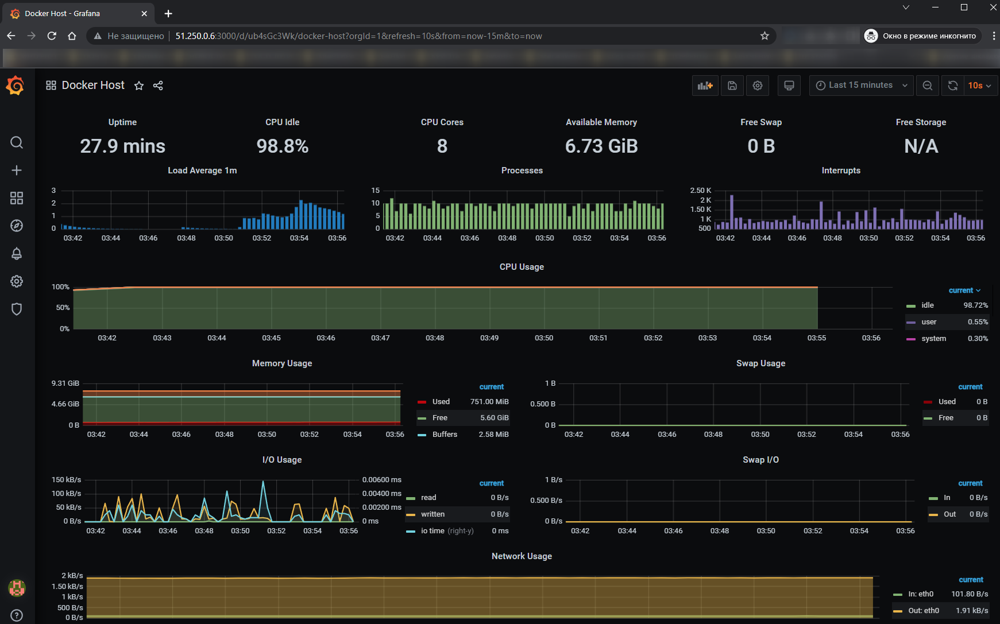
<br>

