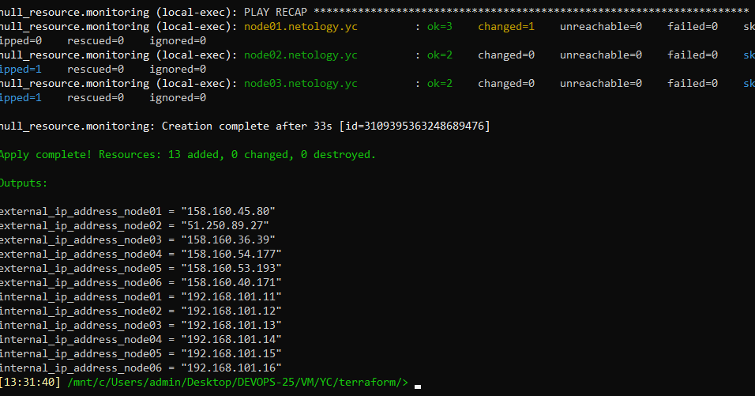
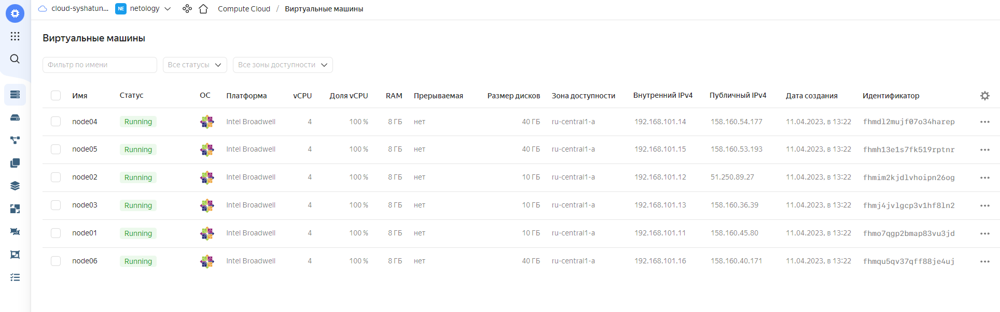
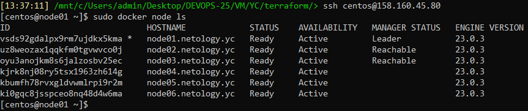
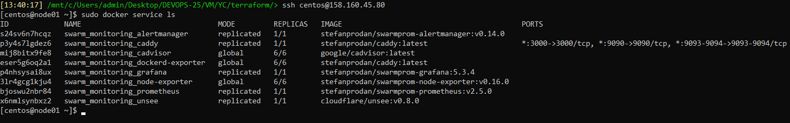

# Домашнее задание 05-virt-05-docker-swarm

<br>

## Задание 1

### В чём отличие режимов работы сервисов в Docker Swarm-кластере: replication и global?
**Docker Swarm** поддерживает два режима развёртывания сервисов: **Replicated** и **Global**. Они отличаются подходом к развёртыванию сервисов:<br>
- **Replicated** – режим в котором необходимо заранее указать количество экземпляров сервисов которые должны быть запущены в кластере. **Docker Swarm** будет поддерживать это количество. При этом нет необходимости указывать на каких нодах кластера будет запущен сервис. Подходит для Stateless приложений.<br><br>
- **Global** – в этом режиме необходимо только указать сервис который должен быть запущен на каждой ноде кластера, а **Docker Swarm** запустит по экземпляру сервиса на каждой ноде кластера. Этот режим подходит дял запуска агентов мониторинга или сбора логов.

### Какой алгоритм выбора лидера используется в Docker Swarm-кластере?
Выбор лидера в **Docker Swarm** осуществляется при помощи алгоритма **Raft**.<br><br>
В **Docker Swarm** кластере существуют мастер ноды (хранят состояние кластера) и рабочие ноды. Состояние кластера должно быть согласовано и копия состояния должна храниться на каждой мастер ноде. При этом среди мастеров всегда должна сущестовать лидирующая нода. Наличие одинакового согласованного состояния кластера гарантирует, что при возникновении сбоев, в том числе выводе из стоя лидирующей ноды, новая лидирующая нода может быть выбрана из существующих мастеров.<br><br>
**Raft** допускает до (N-1)/2 сбоев и требует большинства или кворума из (N/2)+1 членов для согласования значений. Это означает, что в кластере из 5 менеджеров, работающих под управлением **Raft**, если 3 узла недоступны, система больше не может обрабатывать запросы для планирования дополнительных задач, при этом существующие задачи продолжают выполняться.

### Что такое Overlay Network?
Overlay Network – это тип сети в Docker кластерах. Он позволяет создать единую сеть между различными нодами кластера. Контейнеры в этом типе сети находятся в едином адресном пространстве и могут напрямую взаимодействовать друг с другом. Передаваемые данные в Overley сети могут быть зашифрованы, если шифрование включено.
<br>

## Задание 2
Создайте ваш первый Docker Swarm-кластер в Яндекс Облаке.<br><br>
Чтобы получить зачёт, предоставьте скриншот из терминала (консоли) с выводом команды `docker node ls`.
<br>

#### Cоздал кастомный образ ОС на основе конфигурационного файла Packer (если не осталось с прошлого домашнего задания):
```
cd src/packer
packer build centos-7-base.json
yc compute image list
```

#### Внес изменения в файл **src/terraform/variables.tf** указав данные для своего Яндекс Облака. Создал VM'ы используя Terraform:
```
cd src/terraform
terraform init
terraform plan
terraform apply
```



<br>

```
ssh centos@158.160.45.80
sudo docker node ls
```

<br>

## Задание 3
Создайте ваш первый, готовый к боевой эксплуатации кластер мониторинга, состоящий из стека микросервисов.<br><br>
Для получения зачета, вам необходимо предоставить скриншот из терминала (консоли), с выводом команды `docker service ls`.<br>

```
ssh centos@158.160.45.80
sudo docker service ls
```

<br>