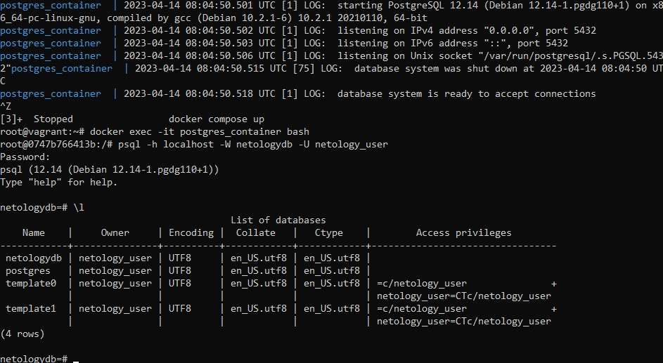
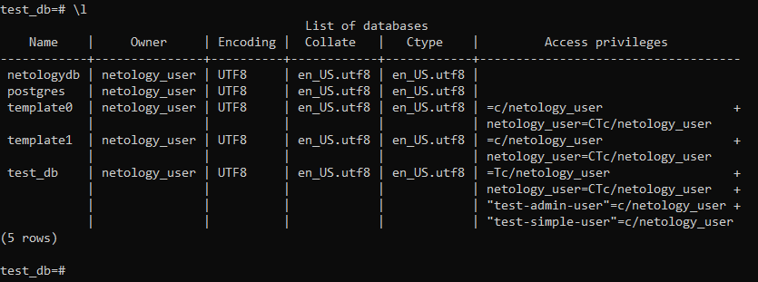
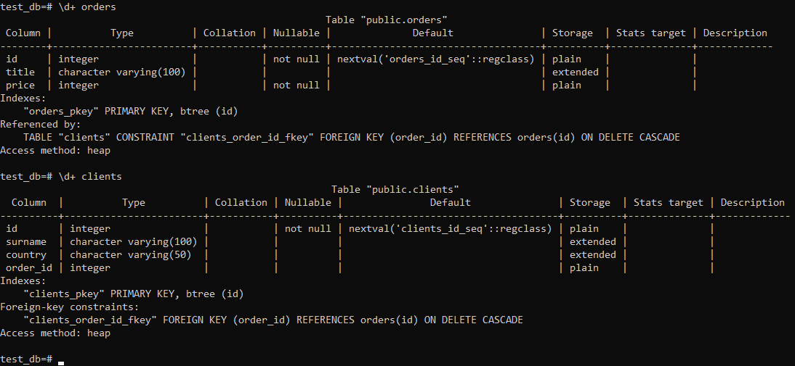
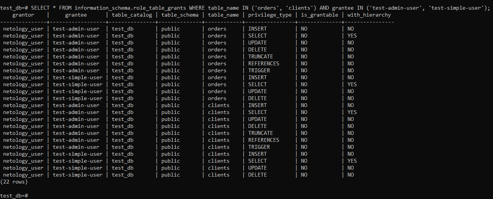
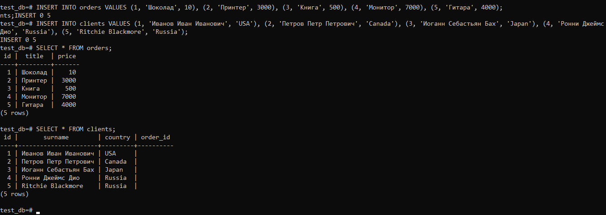
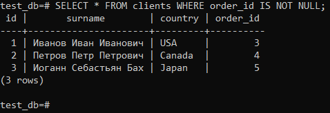
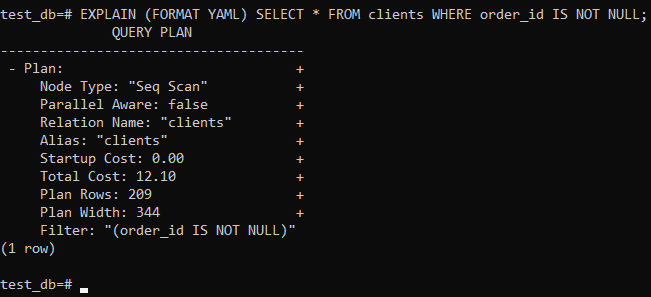
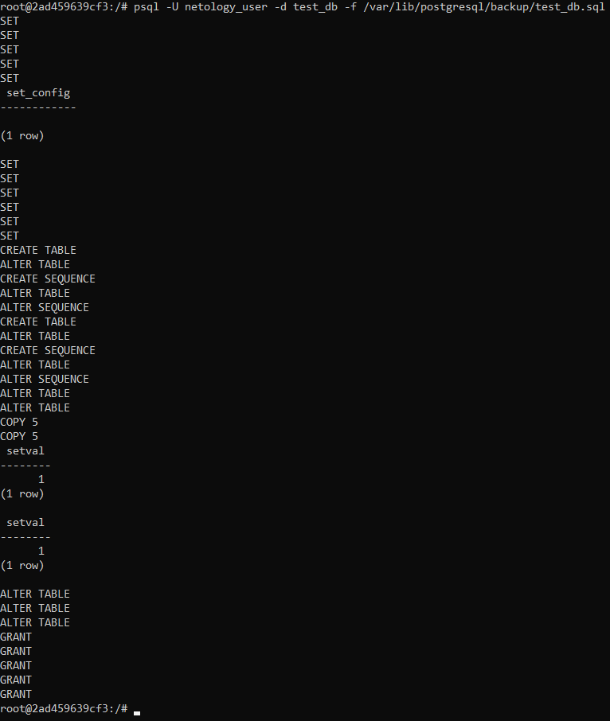
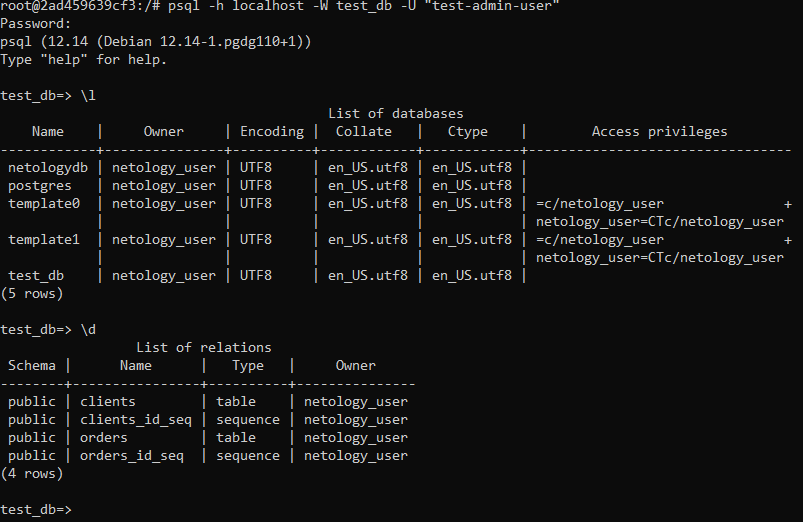

# Домашнее задание 06-db-02-sql

<br>

## Задание 1
### Используя Docker, поднимите инстанс PostgreSQL (версию 12) c 2 volume, в который будут складываться данные БД и бэкапы. Приведите получившуюся команду или docker-compose-манифест.

#### docker-compose.yaml:
```
version: "3.9"
services:
  postgres:
    container_name: postgres_container
    image: postgres:12.14
    environment:
      POSTGRES_DB: "netologydb"
      POSTGRES_USER: "netology_user"
      POSTGRES_PASSWORD: "netology_password"
      PGDATA: /var/lib/postgresql/data
    volumes:
      - ~/postgresql/data:/var/lib/postgresql/data
      - ~/postgresql/backup:/var/lib/postgresql/backup
    ports:
      - "5432:5432"
```

```
docker compose up
docker exec -it postgres_container bash
psql -h localhost -W netologydb -U netology_user
```


<br>


## Задание 2
### В БД из задачи 1:
- Создайте пользователя test-admin-user и БД test_db:
```
CREATE USER "test-admin-user" WITH ENCRYPTED PASSWORD 'password_1';
CREATE DATABASE test_db WITH ENCODING = 'UTF8';
```

Переключаемся на созданную БД:
```
\c test_db;
```

- В БД test_db создайте таблицу orders и clients (спeцификация таблиц ниже):

**Таблица orders:** ***id*** (serial primary key), ***наименование*** (string), ***цена*** (integer).<br>
**Таблица clients:** ***id*** (serial primary key); ***фамилия*** (string); ***страна проживания*** (string, index); ***заказ*** (foreign key orders).

```
CREATE TABLE IF NOT EXISTS orders (id SERIAL PRIMARY KEY, title VARCHAR(100), price INT NOT NULL);
CREATE TABLE IF NOT EXISTS clients (id SERIAL PRIMARY KEY, surname VARCHAR(100), country VARCHAR(50), order_id INT REFERENCES orders(id) ON DELETE CASCADE);
```
- Предоставьте привилегии на все операции пользователю test-admin-user на таблицы БД test_db:
```
GRANT CONNECT ON DATABASE test_db to "test-admin-user";
GRANT ALL ON ALL TABLES IN SCHEMA public TO "test-admin-user";
```
- Создайте пользователя test-simple-user:
```
CREATE USER "test-simple-user" WITH ENCRYPTED PASSWORD 'password_2';
```
- Предоставьте пользователю test-simple-user права на SELECT/INSERT/UPDATE/DELETE этих таблиц БД test_db:
```
GRANT CONNECT ON DATABASE test_db TO "test-simple-user";
GRANT USAGE ON SCHEMA public TO "test-simple-user";
GRANT SELECT, INSERT, UPDATE, DELETE ON ALL TABLES IN SCHEMA public to "test-simple-user";
```

### Приведите:
- Итоговый список БД после выполнения пунктов выше:
```
\l
```


- Описание таблиц (describe):
```
\d+ orders
\d+ clients
```


- SQL-запрос для выдачи списка пользователей с правами над таблицами test_db:
```
SELECT * FROM information_schema.role_table_grants WHERE table_name IN ('orders', 'clients') AND grantee IN ('test-admin-user', 'test-simple-user');
```

- Список пользователей с правами над таблицами test_db:


<br>


## Задание 3
### Используя SQL-синтаксис, наполните таблицы следующими тестовыми данными:

#### Таблица orders
| Наименование | Цена  |
|--------------|-------|
| Шоколад      | 10    |
| Принтер      | 3000  |
| Книга        | 500   |
| Монитор      | 7000  |
| Гитара       | 4000  |

#### Таблица clients
| ФИО                   | Страна проживания |
|-----------------------|-------------------|
| Иванов Иван Иванович  | USA               |
| Петров Петр Петрович  | Canada            |
| Иоганн Себастьян Бах  | Japan             |
| Ронни Джеймс Дио      | Russia            |
| Ritchie Blackmore     | Russia            |

### Используя SQL-синтаксис:
- вычислите количество записей для каждой таблицы.

```
INSERT INTO orders VALUES (1, 'Шоколад', 10), (2, 'Принтер', 3000), (3, 'Книга', 500), (4, 'Монитор', 7000), (5, 'Гитара', 4000);
INSERT INTO clients VALUES (1, 'Иванов Иван Иванович', 'USA'), (2, 'Петров Петр Петрович', 'Canada'), (3, 'Иоганн Себастьян Бах', 'Japan'), (4, 'Ронни Джеймс Дио', 'Russia'), (5, 'Ritchie Blackmore', 'Russia');
SELECT * FROM orders;
SELECT * FROM clients;
```

<br>


## Задание 4
Часть пользователей из таблицы clients решили оформить заказы из таблицы orders. Используя foreign keys, свяжите записи из таблиц, согласно таблице:

| ФИО                   | Заказ   |
|-----------------------|---------|
| Иванов Иван Иванович  | Книга   |
| Петров Петр Петрович  | Монитор |
| Иоганн Себастьян Бах  | Гитара  |

***Подсказка: используйте директиву `UPDATE`.***

#### Приведите SQL-запросы для выполнения этих операций.
```
UPDATE clients SET order_id=3 WHERE id=1;
UPDATE clients SET order_id=4 WHERE id=2;
UPDATE clients SET order_id=5 WHERE id=3;
```

#### Приведите SQL-запрос для выдачи всех пользователей, которые совершили заказ, а также вывод этого запроса.
```
SELECT * FROM clients WHERE order_id IS NOT NULL;
```

<br>

## Задание 5
Получите полную информацию по выполнению запроса выдачи всех пользователей из задачи 4 (используя директиву EXPLAIN).
```
EXPLAIN (FORMAT YAML) SELECT * FROM clients WHERE order_id IS NOT NULL;
```
Приведите получившийся результат и объясните, что значат полученные значения.



**EXPLAIN** – позволяет получить статистику по выполняемому запросу.<br><br>
**Seq Scan** – последовательное, блок за блоком, чтение данных.<br>
**Cost** – понятие призванное оценить затратность операции. **Startup Cost** равное 0.00, это затраты на получение первой строки. **Total Cost** равное 12.10, это затраты на получение всех строк.<br>
**Plan Rows** – приблизительное количество возвращаемых строк при выполнении операции Seq Scan.<br>
**Plan Width** – средний размер одной строки в байтах.<br>
<br>

## Задание 6
Создайте бэкап БД test_db и поместите его в volume, предназначенный для бэкапов (см. задачу 1).<br>
Остановите контейнер с PostgreSQL, но не удаляйте volumes.<br>
Поднимите новый пустой контейнер с PostgreSQL.<br>
Восстановите БД test_db в новом контейнере.<br>
Приведите список операций, который вы применяли для бэкапа данных и восстановления.

Создание бекапа БД:
```
docker exec -it postgres_container bash
pg_dump -U netology_user -d test_db > /var/lib/postgresql/backup/test_db.sql
```

Остановка контейнера:
```
docker compose down
```

Обновлённый **docker-compose.yaml**:
```
version: "3.9"
services:
  postgres:
    container_name: postgres_container
    image: postgres:12.14
    environment:
      POSTGRES_DB: "netologydb"
      POSTGRES_USER: "netology_user"
      POSTGRES_PASSWORD: "netology_password"
      PGDATA: /var/lib/postgresql/data
    volumes:
      - ~/postgresql/data:/var/lib/postgresql/data
      - ~/postgresql/backup:/var/lib/postgresql/backup
    ports:
      - "5432:5432"
      
  postgres_restore:
    container_name: postgres_container_restore
    image: postgres:12.14
    environment:
      POSTGRES_DB: "netologydb"
      POSTGRES_USER: "netology_user"
      POSTGRES_PASSWORD: "netology_password"
      PGDATA: /var/lib/postgresql/data
    volumes:
      - ~/postgresql/data_restore:/var/lib/postgresql/data
      - ~/postgresql/backup:/var/lib/postgresql/backup
    ports:
      - "5433:5432"
```

```
docker compose up
docker exec -it postgres_container_restore bash
psql -h localhost -W netologydb -U netology_user
```
```
CREATE DATABASE test_db WITH ENCODING = 'UTF8';
CREATE USER "test-admin-user" WITH ENCRYPTED PASSWORD 'password_1';
CREATE USER "test-simple-user" WITH ENCRYPTED PASSWORD 'password_2';
```
```
psql -U netology_user -d test_db -f /var/lib/postgresql/backup/test_db.sql
```




<br>

