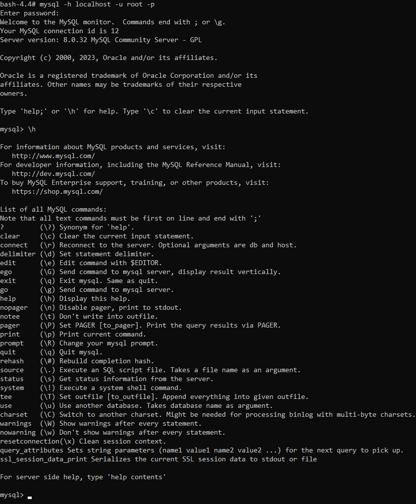
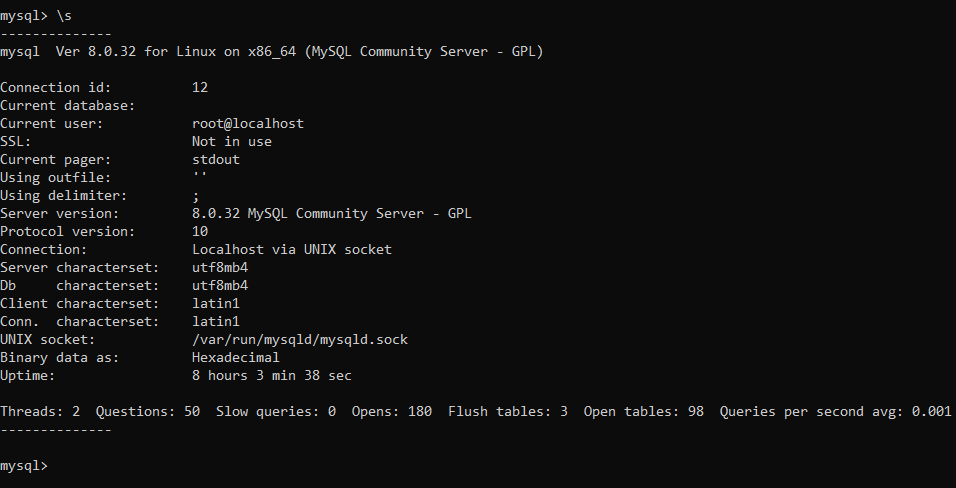
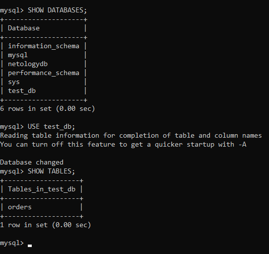
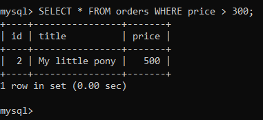
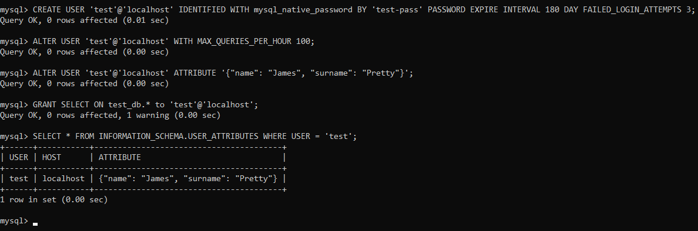
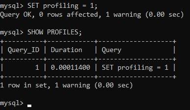
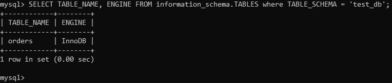
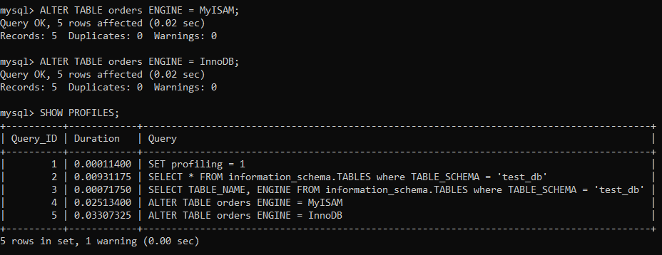

# Домашнее задание 06-db-03-mysql

<br>

## Задание 1
### Используя Docker, поднял инстанс MySQL (версию 8). Данные БД сохранил в volume.

#### docker-compose.yaml:
```
version: "3.9"
services:
  mysql:
    container_name: mysql_container
    image: mysql:8.0
    environment:
      MYSQL_DATABASE: "netologydb"
      MYSQL_USER: "netology_user"
      MYSQL_PASSWORD: "netology_password"
      MYSQL_ONETIME_PASSWORD: true
      MYSQL_RANDOM_ROOT_PASSWORD: true
    volumes:
      - ~/mysql:/var/lib/mysql
    ports:
      - "3306:3306"
```

### Запустил контейнер с MySQL 8 и подключился к нему:
```
docker compose up
docker exec -it mysql_container bash
```

### Изучил [бэкап БД](https://github.com/netology-code/virt-homeworks/tree/virt-11/06-db-03-mysql/test_data) и восстановился из него.<br>
```
mysql -h localhost -u root -p
CREATE DATABASE test_db;
exit;

mysql -h localhost -u root -p test_db < /var/lib/mysql/test_dump.sql
```

### Перешёл в управляющую консоль `mysql` внутри контейнера. Используя команду `\h`, получил список управляющих команд.
```
mysql -h localhost -u root -p
\h
```


### Нашёл команду для выдачи статуса БД и **привёл в ответе** из её вывода версию сервера БД.
```
\s
```


### Подключился к восстановленной БД и получил список таблиц из этой БД.
```
SHOW DATABASES;
USE test_db;
SHOW TABLES;
```


### **Привел в ответе** количество записей с `price` > 300.
```
SELECT * FROM orders WHERE price > 300;
```


В следующих заданиях мы будем продолжать работу с этим контейнером.
<br>


## Задание 2
### Создал пользователя test в БД c паролем test-pass, используя:
- плагин авторизации **mysql_native_password**
- срок истечения пароля — 180 дней 
- количество попыток авторизации — 3 
- максимальное количество запросов в час — 100
- аттрибуты пользователя:
    - Фамилия "Pretty"
    - Имя "James".
```
CREATE USER 'test'@'localhost' IDENTIFIED WITH mysql_native_password BY 'test-pass' PASSWORD EXPIRE INTERVAL 180 DAY FAILED_LOGIN_ATTEMPTS 3;
ALTER USER 'test'@'localhost' WITH MAX_QUERIES_PER_HOUR 100;
ALTER USER 'test'@'localhost' ATTRIBUTE '{"name": "James", "surname": "Pretty"}';
```

### Предоставил привилегии пользователю `test` на операции SELECT базы `test_db`. 
```
GRANT SELECT ON test_db.* to 'test'@'localhost';
```

### Используя таблицу INFORMATION_SCHEMA.USER_ATTRIBUTES, получил данные по пользователю `test` и **привел в ответе к задаче**.
```
SELECT * FROM INFORMATION_SCHEMA.USER_ATTRIBUTES WHERE USER = 'test';
```

<br>


## Задание 3
### Установил профилирование `SET profiling = 1`.
```
SET profiling = 1;
```
### Изучил вывод профилирования команд `SHOW PROFILES;`, она отображает список самых последних инструкций, отправленных на сервер.
```
SHOW PROFILES;
```


Последний выполненный запрос был 'SET profiling = 1' длительность запроса 0.00011400.

### Исследовал, какой `engine` используется в таблице БД `test_db` и **привел в ответе**.
```
SELECT TABLE_NAME, ENGINE FROM information_schema.TABLES where TABLE_SCHEMA = 'test_db';
```



### Изменил `engine` и **привел время выполнения и запрос на изменения из профайлера в ответе**:
- на `MyISAM`:
```
ALTER TABLE orders ENGINE = MyISAM;
```

- на `InnoDB`:

```
ALTER TABLE orders ENGINE = InnoDB;
```


<br>


## Задание 4
### Изучил файл `my.cnf` в директории /etc/mysql и изменил его согласно ТЗ (движок InnoDB):
- скорость IO важнее сохранности данных;
- нужна компрессия таблиц для экономии места на диске;
- размер буффера с незакомиченными транзакциями 1 Мб;
- буффер кеширования 30% от ОЗУ;
- размер файла логов операций 100 Мб.

### Изменённый файл `my.cnf`:
```
[mysqld]
skip-host-cache
skip-name-resolve
datadir=/var/lib/mysql
socket=/var/run/mysqld/mysqld.sock
secure-file-priv=/var/lib/mysql-files
user=mysql

pid-file=/var/run/mysqld/mysqld.pid

# Скорость IO важнее сохранности данных
innodb_flush_log_at_trx_commit = 0

# Нужна компрессия таблиц для экономии места на диске, можно использовать Barracuda - формат файла со сжатием
innodb_file_format=Barracuda

# Размер буффера с незакомиченными транзакциями 1 Мб
innodb_log_buffer_size  = 1M

# Буффер кеширования 30% от ОЗУ
key_buffer_size = 9G

# Размер файла логов операций 100 Мб
max_binlog_size = 100M

[client]
socket=/var/run/mysqld/mysqld.sock

!includedir /etc/mysql/conf.d/
```
<br>
