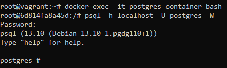
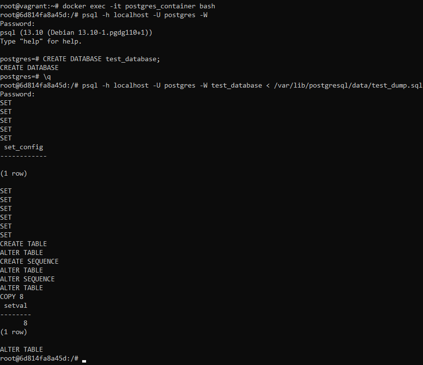
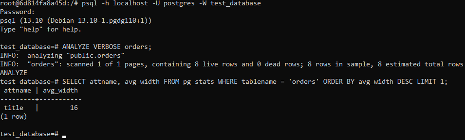
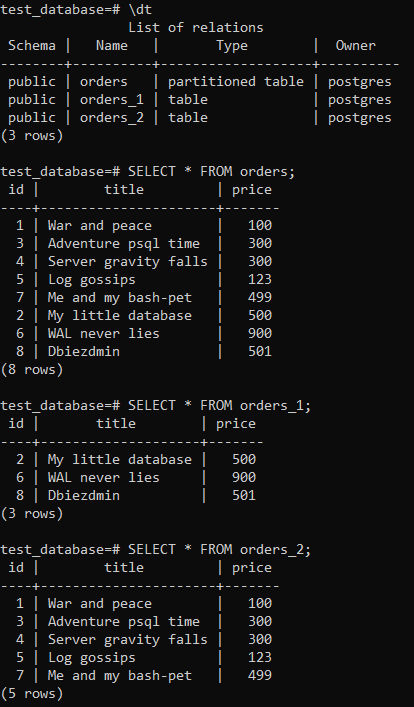

# Домашнее задание 06-db-04-postgresql

<br>

## Задание 1
### Используя Docker, поднял инстанс PostgreSQL (версию 13). Данные БД сохранил в volume.

#### docker-compose.yaml:
```
version: "3.9"
services:
  postgres:
    container_name: postgres_container
    image: postgres:13
    environment:
      POSTGRES_DB: "netologydb"
      POSTGRES_USER: "postgres"
      POSTGRES_PASSWORD: "password"
      PGDATA: /var/lib/postgresql/data
    volumes:
      - ~/postgresql/data:/var/lib/postgresql/data
      - ~/postgresql/backup:/var/lib/postgresql/backup
    ports:
      - "5432:5432"
```

### Запустил контейнер с PostgreSQL 13 и подключился к нему используя `psql`
```
docker compose up
docker exec -it postgres_container bash
psql -h localhost -U postgres -W
```


### Воспользовался командой `\?` для вывода подсказки по имеющимся в `psql` управляющим командам. Нашёл и привел управляющие команды для:
- Вывода списка БД – `\l`
- Подключения к БД – `\c`
- Вывода списка таблиц – `\d`
- Вывода описания содержимого таблиц – `\dt`
- Выхода из psql – `\q`
<br>

## Задание 2
### Используя `psql`, создал БД `test_database`.
```
CREATE DATABASE test_database;
\q
```

### Изучил [бэкап БД](https://github.com/netology-code/virt-homeworks/tree/virt-11/06-db-04-postgresql/test_data) и восстановил бэкап БД в `test_database`.
```
psql -h localhost -U postgres -W test_database < /var/lib/postgresql/data/test_dump.sql
```


### Перешёл в управляющую консоль `psql` внутри контейнера. Подключился к восстановленной БД и провел операцию `ANALYZE` для сбора статистики по таблице. Используя таблицу [pg_stats](https://postgrespro.ru/docs/postgresql/12/view-pg-stats), нашёл столбец таблицы `orders` с наибольшим средним значением размера элементов в байтах.
```
psql -h localhost -U postgres -W test_database
ANALYZE VERBOSE orders;
SELECT attname, avg_width FROM pg_stats WHERE tablename = 'orders' ORDER BY avg_width DESC LIMIT 1;
```

<br>

## Задание 3
### Архитектор и администратор БД выяснили, что ваша таблица orders разрослась до невиданных размеров и поиск по ней занимает долгое время. Вам как успешному выпускнику курсов DevOps в Нетологии предложили провести разбиение таблицы на 2: шардировать на orders_1: price>499 и orders_2: price<=499. Предложите SQL-транзакцию для проведения этой операции.
```
BEGIN;
    ALTER TABLE orders RENAME to orders_old;
	CREATE TABLE orders (
		id INTEGER NOT NULL,
		title VARCHAR(80) NOT NULL,
		price INTEGER
	) PARTITION BY RANGE(price);
	CREATE TABLE orders_1 PARTITION OF orders FOR VALUES FROM (500) TO (MAXVALUE);
	CREATE TABLE orders_2 PARTITION OF orders FOR VALUES FROM (MINVALUE) TO (500);
	INSERT INTO orders (id, title, price) SELECT * FROM orders_old;
	DROP TABLE orders_old;
COMMIT;

SELECT * FROM orders;
SELECT * FROM orders_1;
SELECT * FROM orders_2;
```


### Можно ли было изначально исключить ручное разбиение при проектировании таблицы orders?
Да, если изначально создать таблицу с типом **partitioned table**.
<br>

## Задание 4
### Используя утилиту `pg_dump`, создал бекап БД `test_database`.
```
pg_dump -h localhost -U postgres -d test_database > /var/lib/postgresql/backup/test_database_dump.sql
```

### Как бы вы доработали бэкап-файл, чтобы добавить уникальность значения столбца `title` для таблиц `test_database`?
Можно добавить индекс для столбца `title`.
```
CREATE INDEX ON orders ((lower(title)));
```
<br>
