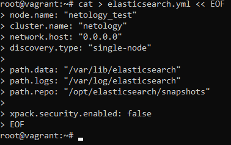
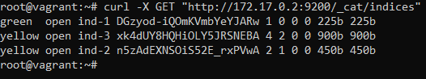

# Домашнее задание 06-db-05-elasticsearch

<br>

## Задание 1
### В этом задании я потренировался в:
- установке Elasticsearch,
- первоначальном конфигурировании Elasticsearch,
- запуске Elasticsearch в Docker.

### Используя Docker-образ [centos:7](https://hub.docker.com/_/centos) как базовый и [документацию по установке и запуску Elastcisearch](https://www.elastic.co/guide/en/elasticsearch/reference/current/targz.html):
- **Составил Dockerfile-манифест для Elasticsearch:**
```
sudo -i

cat > Dockerfile << EOF
FROM centos:7

ENV ELASTIC_USER="elasticsearch"
ENV ELASTIC_HOME="/opt/elasticsearch"
ENV ELASTIC_DATA="/var/lib/elasticsearch"
ENV ELASTIC_LOG="/var/log/elasticsearch"
ENV ELASTIC_BACKUP="/opt/elasticsearch/snapshots"

RUN useradd "\${ELASTIC_USER}" && \
    mkdir -p "\${ELASTIC_HOME}" "\${ELASTIC_DATA}" "\${ELASTIC_LOG}" "\${ELASTIC_BACKUP}"

WORKDIR "\${ELASTIC_HOME}"

RUN yum install wget perl-Digest-SHA -y && \
	wget https://artifacts.elastic.co/downloads/elasticsearch/elasticsearch-8.7.1-linux-x86_64.tar.gz && \
	wget https://artifacts.elastic.co/downloads/elasticsearch/elasticsearch-8.7.1-linux-x86_64.tar.gz.sha512 && \
	shasum -a 512 -c elasticsearch-8.7.1-linux-x86_64.tar.gz.sha512 && \
	tar -xzf elasticsearch-8.7.1-linux-x86_64.tar.gz && \
	cp -rp elasticsearch-8.7.1/* ./ && \
	rm -rf elasticsearch-8.7.1* && \
    yum clean all -y

COPY elasticsearch.yml \${ELASTIC_HOME}/config/elasticsearch.yml

RUN chown -R \${ELASTIC_USER}: "\${ELASTIC_HOME}" "\${ELASTIC_DATA}" "\${ELASTIC_LOG}" "\${ELASTIC_BACKUP}"

USER \${ELASTIC_USER}

EXPOSE 9200
EXPOSE 9300

CMD ["./bin/elasticsearch"]
EOF
```


- **Подготовил `elasticsearch.yml`, в котором данные `path` сохраняются в `/var/lib`, имя ноды `netology_test`:**
```
cat > elasticsearch.yml << EOF
node.name: "netology_test"
cluster.name: "netology"
network.host: "0.0.0.0"
discovery.type: "single-node"

path.data: "/var/lib/elasticsearch"
path.logs: "/var/log/elasticsearch"
path.repo: "/opt/elasticsearch/snapshots"

xpack.security.enabled: false
EOF
```


- **Собрал Docker-образ и сделал `push` в свой docker.io-репозиторий:**
```
docker build -t syshatunov/centos7:06-db-05-elasticsearch .
docker image list
docker login -u syshatunov
docker push syshatunov/centos7:06-db-05-elasticsearch
```

**Ссылка на образ в репозитории DockerHub**: https://hub.docker.com/repository/docker/syshatunov/centos7

- **Запустил контейнер из получившегося образа и выполнил запрос пути `/` c хост-машины:**
```
docker run --name elasticsearch -P -d syshatunov/centos7:06-db-05-elasticsearch
docker ps
curl -X GET http://172.17.0.2:9200/
```


**Ответ `Elasticsearch`**:
```
{
  "name" : "netology_test",
  "cluster_name" : "netology",
  "cluster_uuid" : "Ga4K8bSdTSCRLWS7uNhSgQ",
  "version" : {
    "number" : "8.7.1",
    "build_flavor" : "default",
    "build_type" : "tar",
    "build_hash" : "f229ed3f893a515d590d0f39b05f68913e2d9b53",
    "build_date" : "2023-04-27T04:33:42.127815583Z",
    "build_snapshot" : false,
    "lucene_version" : "9.5.0",
    "minimum_wire_compatibility_version" : "7.17.0",
    "minimum_index_compatibility_version" : "7.0.0"
  },
  "tagline" : "You Know, for Search"
}
```
<br>


## Задание 2
**В этом задании я научился:**
- создавать и удалять индексы,
- изучать состояние кластера,
- обосновывать причину деградации доступности данных.

### Ознакомился с [документацией](https://www.elastic.co/guide/en/elasticsearch/reference/current/indices-create-index.html) и добавил в `Elasticsearch` 3 индекса в соответствии с таблицей:

| Имя    | Количество реплик | Количество шард |
|--------|-------------------|-----------------|
| ind-1  | 0                 | 1               |
| ind-2  | 1                 | 2               |
| ind-3  | 2                 | 4               |

```
curl -X PUT "http://172.17.0.2:9200/ind-1?pretty" -H 'Content-Type: application/json' -d'{"settings": {"number_of_replicas": 0, "number_of_shards": 1}}'
curl -X PUT "http://172.17.0.2:9200/ind-2?pretty" -H 'Content-Type: application/json' -d'{"settings": {"number_of_replicas": 1, "number_of_shards": 2}}'
curl -X PUT "http://172.17.0.2:9200/ind-3?pretty" -H 'Content-Type: application/json' -d'{"settings": {"number_of_replicas": 2, "number_of_shards": 4}}'
```


### Получил список индексов и их статусов, используя API, и **привел в ответе** на задание:
```
curl -X GET "http://172.17.0.2:9200/_cat/indices"
```


### Получил состояние кластера `Elasticsearch`, используя API:
```
curl -X GET "http://172.17.0.2:9200/_cluster/health/?pretty=true"
```


### Как вы думаете, почему часть индексов и кластер находятся в состоянии yellow?
Elasticsearch запущен в single-node кластере и при этом для некоторых индексов указано число реплик. Elasticsearch пометил некоторые индексы статусом yellow, т.к. они не могут быть реплицированы на другой сервер.

### Удалил все индексы:
```
curl -X DELETE "http://172.17.0.2:9200/ind-1?pretty"
curl -X DELETE "http://172.17.0.2:9200/ind-2?pretty"
curl -X DELETE "http://172.17.0.2:9200/ind-3?pretty"
```

<br>


## Задание 3
**В этом задании я научился:**
- создавать бэкапы данных,
- восстанавливать индексы из бэкапов.

### Создал директорию `{путь до корневой директории с Elasticsearch в образе}/snapshots`:
```
docker exec -it elasticsearch /bin/bash
cd /opt/elasticsearch && ls -lah
exit
```


### Используя API, [зарегистрировал](https://www.elastic.co/guide/en/elasticsearch/reference/current/snapshots-register-repository.html#snapshots-register-repository) эту директорию как `snapshot repository` c именем `netology_backup`:
```
curl -X POST "http://172.17.0.2:9200/_snapshot/netology_backup?pretty" -H 'Content-Type: application/json' -d'{"type": "fs", "settings": {"location": "/opt/elasticsearch/snapshots"}}'
curl -X GET "http://172.17.0.2:9200/_snapshot/netology_backup?pretty"
```


### Создал индекс `test` с 0 реплик и 1 шардом и **привёл в ответе** список индексов:
```
curl -X PUT "http://172.17.0.2:9200/test?pretty" -H 'Content-Type: application/json' -d'{"settings": {"index": {"number_of_replicas": 0, "number_of_shards": 1}}}'
```


### [Создал `snapshot`](https://www.elastic.co/guide/en/elasticsearch/reference/current/snapshots-take-snapshot.html) состояния кластера `Elasticsearch`:
```
curl -X PUT "http://172.17.0.2:9200/_snapshot/netology_backup/snapshot_1?wait_for_completion=true&pretty"
docker exec -it elasticsearch /bin/bash
cd /opt/elasticsearch/snapshots && ls -lah
exit
```


### Удалил индекс `test` и создал индекс `test-2`:
```
curl -X DELETE "http://172.17.0.2:9200/test?pretty"
curl -X PUT "http://172.17.0.2:9200/test-2?pretty" -H 'Content-Type: application/json' -d'{"settings": {"number_of_replicas": 0, "number_of_shards": 1}}'
curl -X GET "http://172.17.0.2:9200/_cat/indices?v"
```


### [Восстановил](https://www.elastic.co/guide/en/elasticsearch/reference/current/snapshots-restore-snapshot.html) состояние кластера `Elasticsearch` из `snapshot`, созданного ранее:
```
curl -X POST "http://172.17.0.2:9200/_snapshot/netology_backup/snapshot_1/_restore?pretty"
curl -X GET "http://172.17.0.2:9200/_cat/indices?v"
```

<br>
