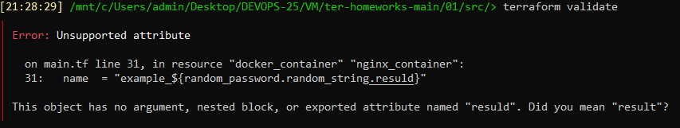

# Домашнее задание 07-ter-homeworks-01 «Введение в Terraform»

<br>

### Скачал и установил актуальную версию **terraform**:
```
terraform --version
```


### Скачал на свой ПК [git репозиторий](https://github.com/netology-code/ter-homeworks).


### Убедился, что в моей ОС установлен docker.
```
docker -v
```


## Задание 1
### 1. Перешёл в каталог [**src**](https://github.com/netology-code/ter-homeworks/tree/main/01/src). Скачал все необходимые зависимости, использованные в проекте.
```
terraform init
```


### 2. Изучил файл **.gitignore**. Согласно этому .gitignore личную, секретную информацию допустимо сохранить в файле **personal.auto.tfvars**.
```
cat .gitignore
```


### 3. Выполнил код проекта. Нашел в State-файле секретное содержимое созданного ресурса **random_password**.
```
terraform plan
terraform apply
cat terraform.tfstate
```


### 4. Раскомментировал блок кода, примерно расположенный на строчках 24-37 файла **main.tf**.
```
terraform validate
```




#### Получил две ошибки, а в процессе правок еще две которые говорят о том, что:
1) Отсутствует имя ресурса.
2) Невалидное имя ресурса, оно может начинаться только с буквы или символа подчёркивания, но не с цифры. 
3) Ресурс **"random_password"** **"random_string_fake"** не задекларирован в корневом модуле.
4) Неверное имя атрибута **"resuld"**.

#### Исправил:


### 5. Выполнил код. В качестве ответа прикладываю вывод команды ```docker ps```
```
sudo -i
cd /mnt/c/Users/admin/Desktop/DEVOPS-25/VM/ter-homeworks-main/01/src/
terraform init
terraform plan
terraform apply
docker ps
```


### 6. Заменил имя docker-контейнера в блоке кода на ```hello_world```, выполнил команду ```terraform apply -auto-approve```.
```
terraform apply -auto-approve
docker ps
```

<br>

При использовании ключа ```-auto-approve``` **Terraform** автоматически выполняет изменения в инфраструктуре без запроса подтверждения и проверки.
<br><br>
Это весьма опасно, т.к. могут быть непредвиденные последствия и ошибки, например будет удален важный ресурс или потеряются данные, что приведет к некорректной работе приложения или полной его остановке.

### 7. Уничтожил созданные ресурсы с помощью **terraform**. Убедился, что все ресурсы удалены. Приложил содержимое файла **terraform.tfstate**.
```
terraform destroy
cat terraform.tfstate
```


### 8. Объясните, почему при этом не был удален docker образ **nginx:latest** ?(Ответ найдите в коде проекта или документации).
Не удалён, т.к. параметр ```keep_locally``` выставлен в значение **true** – он означает, что при удалении ресурса локальный экземпляр образа остаётся.
<br>

