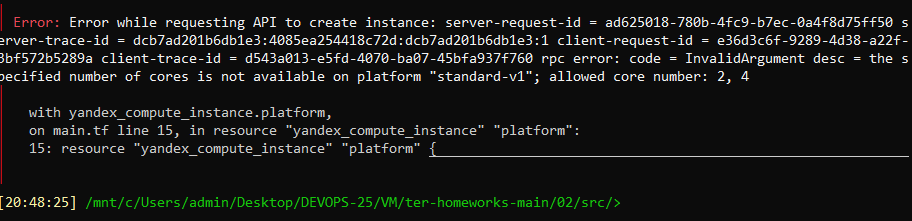
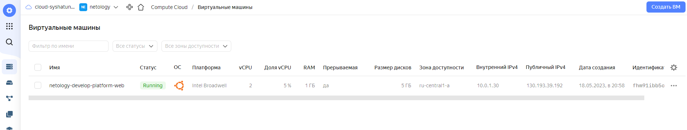
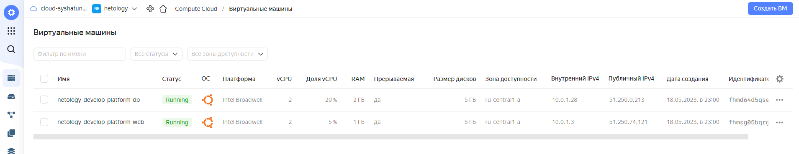

# Домашнее задание 07-ter-homeworks-02 «Основы Terraform. Yandex Cloud»

<br>

### 1. Зарегистрировал аккаунт в Yandex Cloud. Использован промокод на грант.


### 2. Установил инструмент Yandex Cli.


### 3. Скачал исходный код для выполнения задания расположенный в директории [**02/src**](https://github.com/netology-code/ter-homeworks/tree/main/02/src).
<br>


## Задание 0
### 1. Ознакомился с [документацией к **security-groups** в Yandex Cloud](https://cloud.yandex.ru/docs/vpc/concepts/security-groups?from=int-console-help-center-or-nav).
### 2. Запросил и получил **preview доступ** к данному функционалу в ЛК Yandex Cloud.<br><br>
***https://console.cloud.yandex.ru/folders/<ваш folder_id>/vpc/security-groups***.


<br>


## Задание 1
### 1. Изучил проект, в том числе файл variables.tf в котором объявлены переменные для yandex provider.

### 2. Переименовал файл personal.auto.tfvars_example в personal.auto.tfvars. Заполнил переменные (идентификаторы облака, токен доступа). Благодаря .gitignore этот файл не попадет в публичный репозиторий. **Но можно выбрать иной способ безопасно передать секретные данные в terraform.**
```
mv personal.auto.tfvars_example personal.auto.tfvars
```

### 3. Сгенерировал ssh ключ. Записал его открытую часть в переменную **vms_ssh_root_key** *(в файле src/variables.tf)*.
```
ssh-keygen -t ed25519
cat ~/.ssh/id_ed25519.pub
```

### 4. Инициализировал проект, выполнил код. Исправил возникшую ошибку. Ответил в чем заключается ее суть.
```
terraform init
terraform plan
terraform apply
```


При выполнении кода получил ошибку, говорящую о том, что для платформы **standard-v1** доступны к использованию только 2 или 4 ядра, а ну нас указано 1 ядро. Исправил на 2.
```
terraform destroy
terraform plan
terraform apply
```



```
ssh -i ~/.ssh/id_ed25519 'ubuntu@130.193.39.192'
```


### 5. В процессе обучения могут пригодиться параметры ```preemptible = true``` и ```core_fraction=5``` в параметрах ВМ.
- [`preemptible`](https://cloud.yandex.ru/docs/compute/concepts/preemptible-vm) – прерываемые виртуальные машины, это ВМ, которые могут быть принудительно остановлены в любой момент (если с момента запуска виртуальной машины прошло 24 часа, либо если возникнет нехватка ресурсов для запуска обычной ВМ в той же зоне доступности).
- [`core_fraction`](https://cloud.yandex.ru/docs/compute/concepts/performance-levels) – уровни производительности vCPU (минимальные конфигурации указаны для уровня производительности 5%).<br><br>
    ***Для обучения оба параметра являются ценными, т.к. указав их можно сэкономить денежные средства!***
<br>


## Задание 2
### 1. Изучил файлы проекта.
### 2. Заменил все "хардкод" **значения** для ресурсов **yandex_compute_image** и **yandex_compute_instance** на **отдельные** переменные. К названиям переменных ВМ добавил в начало префикс **vm_web_**.
#### Исправленный main.tf:
```
resource "yandex_vpc_network" "develop" {
  name = var.vpc_name
}
resource "yandex_vpc_subnet" "develop" {
  name           = var.vpc_name
  zone           = var.default_zone
  network_id     = yandex_vpc_network.develop.id
  v4_cidr_blocks = var.default_cidr
}


data "yandex_compute_image" "ubuntu" {
  family = var.vm_web_image_family
}
resource "yandex_compute_instance" "vm_web" {
  name        = var.vm_web_name
  platform_id = var.vm_web_platform_id
  resources {
    cores         = var.vm_web_cores
    memory        = var.vm_web_memory
    core_fraction = var.vm_web_core_fraction
  }
  boot_disk {
    initialize_params {
      image_id = data.yandex_compute_image.ubuntu.image_id
    }
  }
  scheduling_policy {
    preemptible = true
  }
  network_interface {
    subnet_id = yandex_vpc_subnet.develop.id
    nat       = true
  }

  metadata = {
    serial-port-enable = 1
    ssh-keys           = var.vms_ssh_root_key
  }

}
```
### 3. Объявил нужные переменные в файле variables.tf, с указанием типа переменной. Заполнил их **default** прежними значениями из main.tf.
#### Исправленный variables.tf:
```
###cloud vars

variable "token" {
  type        = string
  description = "OAuth-token; https://cloud.yandex.ru/docs/iam/concepts/authorization/oauth-token"
}

variable "cloud_id" {
  type        = string
  description = "https://cloud.yandex.ru/docs/resource-manager/operations/cloud/get-id"
}

variable "folder_id" {
  type        = string
  description = "https://cloud.yandex.ru/docs/resource-manager/operations/folder/get-id"
}

variable "default_zone" {
  type        = string
  default     = "ru-central1-a"
  description = "https://cloud.yandex.ru/docs/overview/concepts/geo-scope"
}
variable "default_cidr" {
  type        = list(string)
  default     = ["10.0.1.0/24"]
  description = "https://cloud.yandex.ru/docs/vpc/operations/subnet-create"
}

variable "vpc_name" {
  type        = string
  default     = "develop"
  description = "VPC network & subnet name"
}


###ssh vars

variable "vms_ssh_root_key" {
  type        = string
  default     = "ubuntu:ssh-ed25519 XXXXXXXXXXXXXXXXXX administrator@NB-Sergey-Asus"
  description = "ssh-keygen -t ed25519"
}


### NEW VARS

variable "vm_web_image_family" {
  type    = string
  default = "ubuntu-2004-lts"
  description = "Image family name"
}

variable "vm_web_name" {
  type    = string
  default = "netology-develop-platform-web"
  description = "Instance name"
}

variable "vm_web_platform_id" {
  type    = string
  default = "standard-v1"
  description = "Instance platform ID"
}

variable "vm_web_cores" {
  type    = string
  default = "2"
  description = "Cores"
}

variable "vm_web_memory" {
  type    = string
  default = "1"
  description = "Memory size"
}

variable "vm_web_core_fraction" {
  type    = string
  default = "5"
  description = "Core fraction"
}
```

### 5. Проверил terraform plan (изменений быть не должно).
```
terraform plan
```

<br>


## Задание 3
### 1. Создал в корне проекта файл `vms_platform.tf`. Перенёс в него все переменные первой ВМ.
```
cp variables.tf vms_platform.tf
```

### 2. Скопировал блок ресурса и создал с его помощью вторую ВМ (в файле main.tf): **"netology-develop-platform-db"** ,  cores  = 2, memory = 2, core_fraction = 20. Объявил ее переменные с префиксом **vm_db_** в том же файле('vms_platform.tf').
#### Исправленный variables.tf:
```
###cloud vars

variable "token" {
  type        = string
  description = "OAuth-token; https://cloud.yandex.ru/docs/iam/concepts/authorization/oauth-token"
}

variable "cloud_id" {
  type        = string
  description = "https://cloud.yandex.ru/docs/resource-manager/operations/cloud/get-id"
}

variable "folder_id" {
  type        = string
  description = "https://cloud.yandex.ru/docs/resource-manager/operations/folder/get-id"
}

variable "default_zone" {
  type        = string
  default     = "ru-central1-a"
  description = "https://cloud.yandex.ru/docs/overview/concepts/geo-scope"
}
variable "default_cidr" {
  type        = list(string)
  default     = ["10.0.1.0/24"]
  description = "https://cloud.yandex.ru/docs/vpc/operations/subnet-create"
}

variable "vpc_name" {
  type        = string
  default     = "develop"
  description = "VPC network & subnet name"
}


###ssh vars

variable "vms_ssh_root_key" {
  type        = string
  default     = "ubuntu:ssh-ed25519 XXXXXXXXXXXXXXXXXX administrator@NB-Sergey-Asus"
  description = "ssh-keygen -t ed25519"
}

variable "vm_image_family" {
  type    = string
  default = "ubuntu-2004-lts"
  description = "Image family name"
}
```
#### Исправленный vms_platform.tf:
```
### ---- vm_web ----

variable "vm_web_name" {
  type    = string
  default = "netology-develop-platform-web"
  description = "Instance name"
}

variable "vm_web_platform_id" {
  type    = string
  default = "standard-v1"
  description = "Instance platform ID"
}

variable "vm_web_cores" {
  type    = string
  default = "2"
  description = "Cores"
}

variable "vm_web_memory" {
  type    = string
  default = "1"
  description = "Memory size"
}

variable "vm_web_core_fraction" {
  type    = string
  default = "5"
  description = "Core fraction"
}


### ---- vm_db ----

variable "vm_db_name" {
  type    = string
  default = "netology-develop-platform-db"
  description = "Instance name"
}

variable "vm_db_platform_id" {
  type    = string
  default = "standard-v1"
  description = "Instance platform ID"
}

variable "vm_db_cores" {
  type    = string
  default = "2"
  description = "Cores"
}

variable "vm_db_memory" {
  type    = string
  default = "2"
  description = "Memory size"
}

variable "vm_db_core_fraction" {
  type    = string
  default = "20"
  description = "Core fraction"
}
```
#### Исправленный main.tf:
```
resource "yandex_vpc_network" "develop" {
  name = var.vpc_name
}
resource "yandex_vpc_subnet" "develop" {
  name           = var.vpc_name
  zone           = var.default_zone
  network_id     = yandex_vpc_network.develop.id
  v4_cidr_blocks = var.default_cidr
}


data "yandex_compute_image" "ubuntu" {
  family = var.vm_image_family
}


resource "yandex_compute_instance" "vm_web" {
  name        = var.vm_web_name
  platform_id = var.vm_web_platform_id
  resources {
    cores         = var.vm_web_cores
    memory        = var.vm_web_memory
    core_fraction = var.vm_web_core_fraction
  }
  boot_disk {
    initialize_params {
      image_id = data.yandex_compute_image.ubuntu.image_id
    }
  }
  scheduling_policy {
    preemptible = true
  }
  network_interface {
    subnet_id = yandex_vpc_subnet.develop.id
    nat       = true
  }
  metadata = {
    serial-port-enable = 1
    ssh-keys           = var.vms_ssh_root_key
  }
}

resource "yandex_compute_instance" "vm_db" {
  name        = var.vm_db_name
  platform_id = var.vm_db_platform_id
  resources {
    cores         = var.vm_db_cores
    memory        = var.vm_db_memory
    core_fraction = var.vm_db_core_fraction
  }
  boot_disk {
    initialize_params {
      image_id = data.yandex_compute_image.ubuntu.image_id
    }
  }
  scheduling_policy {
    preemptible = true
  }
  network_interface {
    subnet_id = yandex_vpc_subnet.develop.id
    nat       = true
  }
  metadata = {
    serial-port-enable = 1
    ssh-keys           = var.vms_ssh_root_key
  }
}
```
### 3. Применил изменения.
```
terraform plan
terraform apply
```

<br>


## Задание 4
### 1. Объявил в файле outputs.tf output типа map, содержащий { instance_name = external_ip } для каждой из ВМ.
#### Файл outputs.tf:
```
output "external_ip_address_vm_web" {
  value = "${yandex_compute_instance.vm_web.network_interface.0.nat_ip_address}"
}

output "external_ip_address_vm_db" {
  value = "${yandex_compute_instance.vm_db.network_interface.0.nat_ip_address}"
}
```
### 2. Применил изменения.
```
terraform plan
terraform apply
terraform output
```

<br>


## Задание 5
### 1. В файле locals.tf описал в **одном** local-блоке имя каждой ВМ, используя интерполяцию ${..} с несколькими переменными по примеру из лекции.
#### Файл locals.tf:
```
locals {
  vm_web_name = "netology-${var.prefix_name.env}-${var.prefix_name.project}-${var.vm_web_name}"
  vm_db_name  = "netology-${var.prefix_name.env}-${var.prefix_name.project}-${var.vm_db_name}"
}
```

### 2. Заменил переменные с именами ВМ из файла vms_platform.tf на созданные мной local переменные.
#### Исправленный vms_platform.tf:
```
### -- prefix_name --
variable "prefix_name" {
  type = map(string)
  default = {
    env     = "developer",
    project = "platform"
  }
}


### ---- vm_web ----

variable "vm_web_name" {
  type    = string
  default = "web"
  description = "Instance name"
}

variable "vm_web_platform_id" {
  type    = string
  default = "standard-v1"
  description = "Instance platform ID"
}

variable "vm_web_cores" {
  type    = string
  default = "2"
  description = "Cores"
}

variable "vm_web_memory" {
  type    = string
  default = "1"
  description = "Memory size"
}

variable "vm_web_core_fraction" {
  type    = string
  default = "5"
  description = "Core fraction"
}


### ---- vm_db ----

variable "vm_db_name" {
  type    = string
  default = "db"
  description = "Instance name"
}

variable "vm_db_platform_id" {
  type    = string
  default = "standard-v1"
  description = "Instance platform ID"
}

variable "vm_db_cores" {
  type    = string
  default = "2"
  description = "Cores"
}

variable "vm_db_memory" {
  type    = string
  default = "2"
  description = "Memory size"
}

variable "vm_db_core_fraction" {
  type    = string
  default = "20"
  description = "Core fraction"
}
```

#### Исправленный main.tf:
```
resource "yandex_vpc_network" "develop" {
  name = var.vpc_name
}
resource "yandex_vpc_subnet" "develop" {
  name           = var.vpc_name
  zone           = var.default_zone
  network_id     = yandex_vpc_network.develop.id
  v4_cidr_blocks = var.default_cidr
}


data "yandex_compute_image" "ubuntu" {
  family = var.vm_image_family
}


resource "yandex_compute_instance" "vm_web" {
  name        = local.vm_web_name
  platform_id = var.vm_web_platform_id
  resources {
    cores         = var.vm_web_cores
    memory        = var.vm_web_memory
    core_fraction = var.vm_web_core_fraction
  }
  boot_disk {
    initialize_params {
      image_id = data.yandex_compute_image.ubuntu.image_id
    }
  }
  scheduling_policy {
    preemptible = true
  }
  network_interface {
    subnet_id = yandex_vpc_subnet.develop.id
    nat       = true
  }
  metadata = {
    serial-port-enable = 1
    ssh-keys           = var.vms_ssh_root_key
  }
}

resource "yandex_compute_instance" "vm_db" {
  name        = local.vm_db_name
  platform_id = var.vm_db_platform_id
  resources {
    cores         = var.vm_db_cores
    memory        = var.vm_db_memory
    core_fraction = var.vm_db_core_fraction
  }
  boot_disk {
    initialize_params {
      image_id = data.yandex_compute_image.ubuntu.image_id
    }
  }
  scheduling_policy {
    preemptible = true
  }
  network_interface {
    subnet_id = yandex_vpc_subnet.develop.id
    nat       = true
  }
  metadata = {
    serial-port-enable = 1
    ssh-keys           = var.vms_ssh_root_key
  }
}
```

### 3. Применил изменения.
```
terraform plan
terraform apply
terraform console

local.vm_web_name
local.vm_db_name
```

<br>


## Задание 6
### 1. Вместо использования 3-х переменных  ".._cores",".._memory",".._core_fraction" в блоке  resources {...}, объединил их в переменные типа **map** с именами "vm_web_resources" и "vm_db_resources". Так же поступил с блоком **metadata {serial-port-enable, ssh-keys}**, эта переменная общая для всех ВМ.
#### Исправленный vms_platform.tf:
```
### -- prefix_name --
variable "prefix_name" {
  type = map(string)
  default = {
    env     = "developer",
    project = "platform"
  }
}


### ---- vm_web ----

variable "vm_web_name" {
  type    = string
  default = "web"
  description = "Instance name"
}

variable "vm_web_platform_id" {
  type    = string
  default = "standard-v1"
  description = "Instance platform ID"
}

variable "vm_web_resources" { 
  type = map(number)
  default = {
    cores  = 2,
    memory = 1,
    core_fraction = 5
  }
  description = "VM resources"
}


### ---- vm_db ----

variable "vm_db_name" {
  type    = string
  default = "db"
  description = "Instance name"
}

variable "vm_db_platform_id" {
  type    = string
  default = "standard-v1"
  description = "Instance platform ID"
}

variable "vm_db_resources" { 
  type = map(number)
  default = {
    cores  = 2,
    memory = 2,
    core_fraction = 20
  }
  description = "VM resources"
}
```

#### Исправленный variables.tf:
```
###cloud vars

variable "token" {
  type        = string
  description = "OAuth-token; https://cloud.yandex.ru/docs/iam/concepts/authorization/oauth-token"
}

variable "cloud_id" {
  type        = string
  description = "https://cloud.yandex.ru/docs/resource-manager/operations/cloud/get-id"
}

variable "folder_id" {
  type        = string
  description = "https://cloud.yandex.ru/docs/resource-manager/operations/folder/get-id"
}

variable "default_zone" {
  type        = string
  default     = "ru-central1-a"
  description = "https://cloud.yandex.ru/docs/overview/concepts/geo-scope"
}
variable "default_cidr" {
  type        = list(string)
  default     = ["10.0.1.0/24"]
  description = "https://cloud.yandex.ru/docs/vpc/operations/subnet-create"
}

variable "vpc_name" {
  type        = string
  default     = "develop"
  description = "VPC network & subnet name"
}


###ssh vars

variable "vm_image_family" {
  type    = string
  default = "ubuntu-2004-lts"
  description = "Image family name"
}

variable "vm_metadata_resources" { 
  type = map
  default = {
    serial_port_enable = 1,
    ssh_key = "ubuntu:ssh-ed25519 XXXXXXXXXXXXXXXXXX administrator@NB-Sergey-Asus"
  }
  description = "Metadata resources"
}
```

#### Исправленный main.tf:
```
resource "yandex_vpc_network" "develop" {
  name = var.vpc_name
}
resource "yandex_vpc_subnet" "develop" {
  name           = var.vpc_name
  zone           = var.default_zone
  network_id     = yandex_vpc_network.develop.id
  v4_cidr_blocks = var.default_cidr
}


data "yandex_compute_image" "ubuntu" {
  family = var.vm_image_family
}


resource "yandex_compute_instance" "vm_web" {
  name        = local.vm_web_name
  platform_id = var.vm_web_platform_id
  resources {
    cores         = var.vm_web_resources.cores
    memory        = var.vm_web_resources.memory
    core_fraction = var.vm_web_resources.core_fraction
  }
  boot_disk {
    initialize_params {
      image_id = data.yandex_compute_image.ubuntu.image_id
    }
  }
  scheduling_policy {
    preemptible = true
  }
  network_interface {
    subnet_id = yandex_vpc_subnet.develop.id
    nat       = true
  }
  metadata = {
    serial-port-enable = var.vm_metadata_resources.serial_port_enable
    ssh-keys           = var.vm_metadata_resources.ssh_key
  }
}

resource "yandex_compute_instance" "vm_db" {
  name        = local.vm_db_name
  platform_id = var.vm_db_platform_id
  resources {
    cores         = var.vm_db_resources.cores
    memory        = var.vm_db_resources.memory
    core_fraction = var.vm_db_resources.core_fraction
  }
  boot_disk {
    initialize_params {
      image_id = data.yandex_compute_image.ubuntu.image_id
    }
  }
  scheduling_policy {
    preemptible = true
  }
  network_interface {
    subnet_id = yandex_vpc_subnet.develop.id
    nat       = true
  }
  metadata = {
    serial-port-enable = var.vm_metadata_resources.serial_port_enable
    ssh-keys           = var.vm_metadata_resources.ssh_key
  }
}
```

### 3. Нашел и удалил все более не используемые переменные проекта.

### 4. Проверил terraform plan (изменений быть не должно).
```
terraform plan
```

<br>