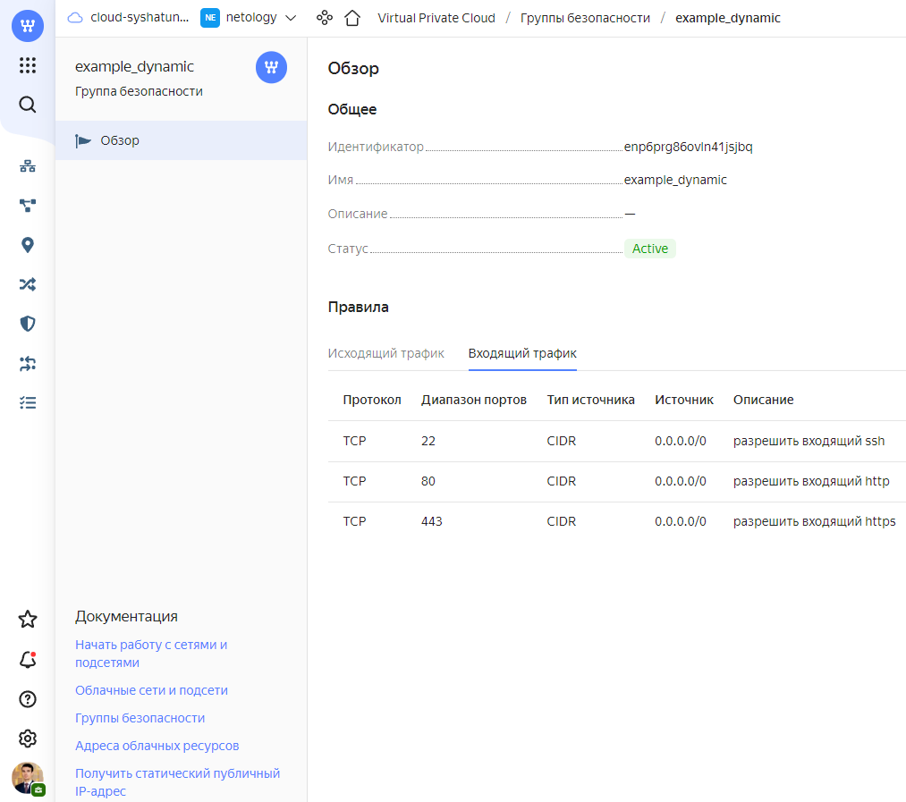
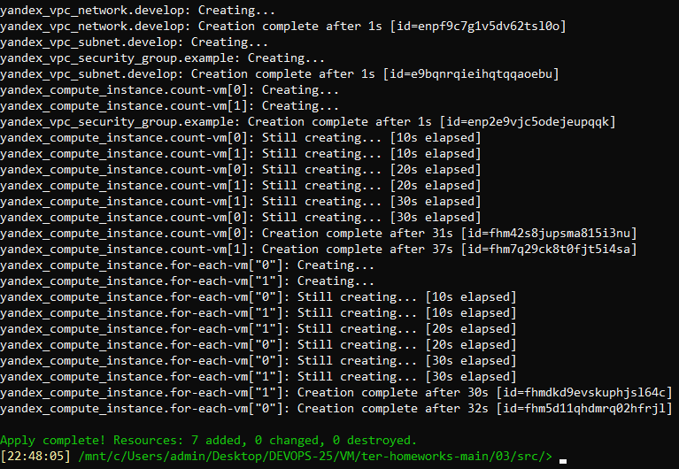
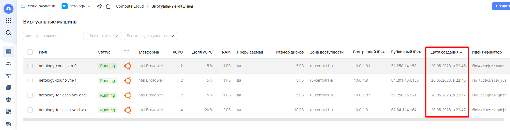
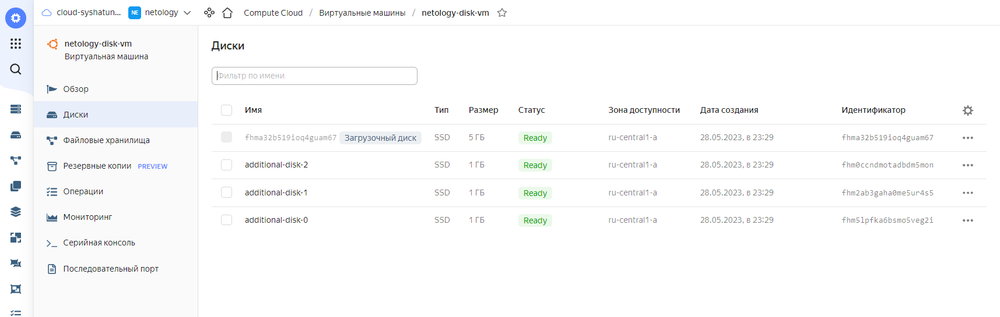
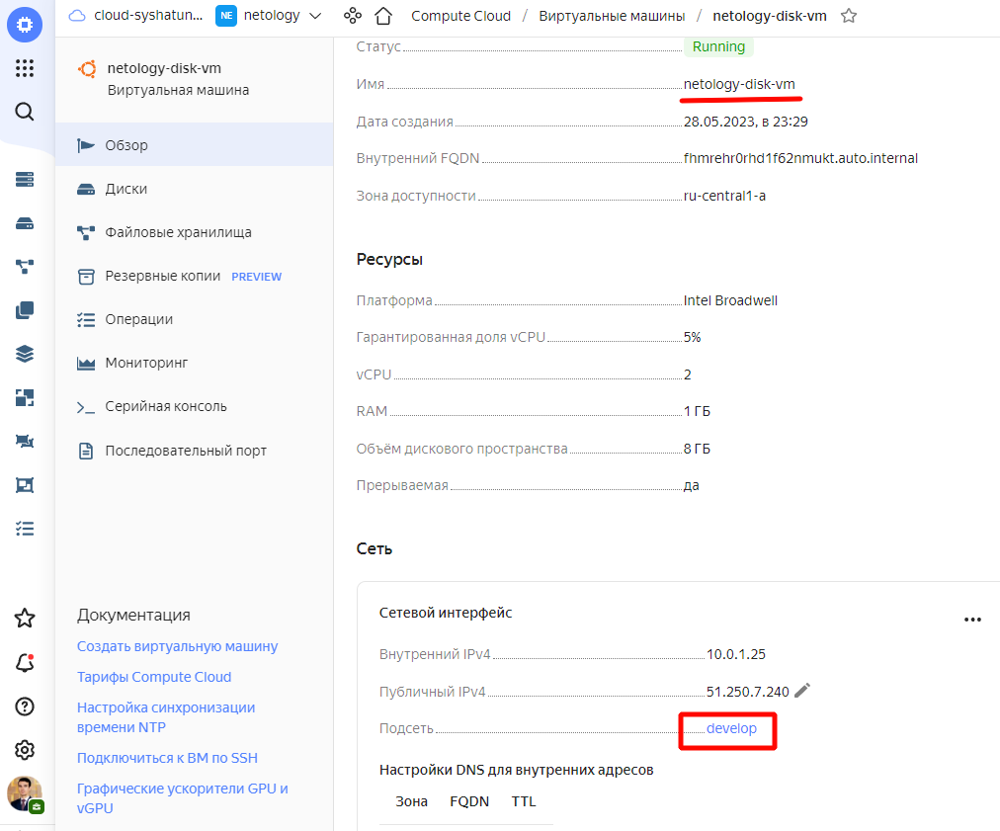
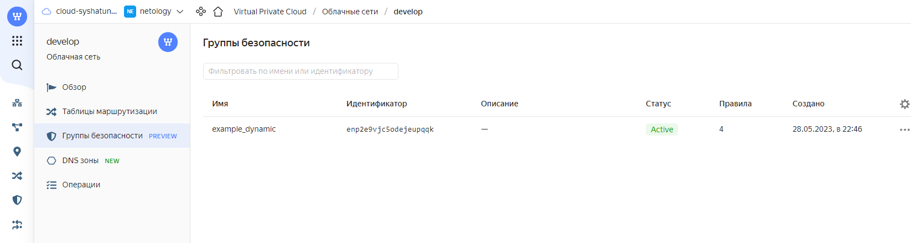
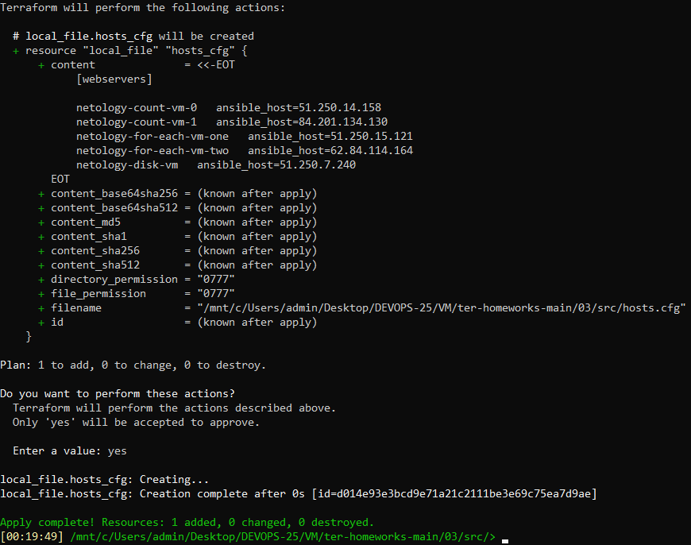

# Домашнее задание 07-ter-homeworks-03 «Управляющие конструкции в коде Terraform»

<br>

## Задание 1
### 1. Изучил проект.
### 2. Заполнил файл **personal.auto.tfvars**
### 3. Инициализировал проект, выполнил код (он выполнится даже если доступа к preview нет).
```
terraform init
terraform plan
terraform apply
```
*Preview доступ к функционалу «Группы безопасности» в Yandex Cloud получен через поддержку облачного провайдера.*<br><br>

**Прикладываю скриншот входящих правил «Группы безопасности» в ЛК Yandex Cloud:**<br><br>


<br>

## Задание 2
### 1. Создал файл count-vm.tf. Описал в нем создание двух **одинаковых** виртуальных машин с минимальными параметрами, используя мета-аргумент **count loop**.
#### Файл count-vm.tf:
```
resource "yandex_compute_instance" "count-vm" {

  count       = 2
  
  name        = "netology-count-vm-${count.index}"
  platform_id = "standard-v1"

  resources {
    cores         = 2
    memory        = 1
    core_fraction = 5
  }

  boot_disk {
    initialize_params {
      image_id = data.yandex_compute_image.ubuntu-2004-lts.image_id
      type     = "network-ssd"
      size     = 5
    }
  }

  metadata = {
    ssh-keys     = local.vms_ssh_root_key
  }

  scheduling_policy { preemptible = true }

  network_interface {
    subnet_id = yandex_vpc_subnet.develop.id
    nat       = true
  }
  allow_stopping_for_update = true
}
```

### 2. Создал файл for_each-vm.tf. Описал в нем создание 2 **разных** по cpu/ram/disk виртуальных машин, используя мета-аргумент **for_each loop** и переменную типа list(object({ vm_name=string, cpu=number, ram=number, disk=number  })). Добавил в переменную все возможные параметры.
#### Файл for_each-vm.tf:
```
resource "yandex_compute_instance" "for-each-vm" {

  # Ожидание создания инстанса count-vm
  depends_on = [yandex_compute_instance.count-vm]

  for_each = { for key, val in var.resources_for_each_vm : key => val }
  name     = "netology-for-each-vm-${each.value.vm_name}"

  resources {
    cores         = each.value.cpu
    memory        = each.value.ram
    core_fraction = each.value.core_fraction
  }

  boot_disk {
    initialize_params {
      image_id = data.yandex_compute_image.ubuntu-2004-lts.image_id
      type     = "network-ssd"
      size     = each.value.disk
    }
  }
  
  metadata = {
    ssh-keys     = local.vms_ssh_root_key
  }

  scheduling_policy { preemptible = true }

  network_interface {
    subnet_id = yandex_vpc_subnet.develop.id
    nat       = true
  }
  allow_stopping_for_update = true

}
```

### 3. ВМ из пункта 2.2 должны создаваться после создания ВМ из пункта 2.1.
Для этого добавил параметр **depends_on = [yandex_compute_instance.count-vm]**

### 4. Используйте функцию file в local переменной для считывания ключа ~/.ssh/id_rsa.pub и его последующего использования в блоке metadata, взятому из ДЗ №2.
#### Изменённый variables.tf:
```
###cloud vars
variable "token" {
  type        = string
  description = "OAuth-token; https://cloud.yandex.ru/docs/iam/concepts/authorization/oauth-token"
}

variable "cloud_id" {
  type        = string
  description = "https://cloud.yandex.ru/docs/resource-manager/operations/cloud/get-id"
}

variable "folder_id" {
  type        = string
  description = "https://cloud.yandex.ru/docs/resource-manager/operations/folder/get-id"
}

variable "default_zone" {
  type        = string
  default     = "ru-central1-a"
  description = "https://cloud.yandex.ru/docs/overview/concepts/geo-scope"
}
variable "default_cidr" {
  type        = list(string)
  default     = ["10.0.1.0/24"]
  description = "https://cloud.yandex.ru/docs/vpc/operations/subnet-create"
}

variable "vpc_name" {
  type        = string
  default     = "develop"
  description = "VPC network&subnet name"
}


### ADDED

locals {
  vms_ssh_root_key = "ubuntu:${file("~/.ssh/id_ed25519.pub")}"
}

variable "resources_for_each_vm" {
  description = "For Each VM resources"
  type = list(object(
    {
      vm_name       = string
      cpu           = number
      ram           = number
      disk          = number
      core_fraction = number
    }
  ))

  default = [
    {
      vm_name       = "one"
      cpu           = 2
      ram           = 1
      disk          = 5
      core_fraction = 5
    },
    {
      vm_name       = "two"
      cpu           = 4
      ram           = 2
      disk          = 10
      core_fraction = 20
    }
  ]
}
```

### 5. Инициализируйте проект, выполните код.
```
terraform init
terraform plan
terraform apply
```



<br>

## Задание 3
### 1. Создал 3 одинаковых виртуальных диска, размером 1 Гб с помощью ресурса yandex_compute_disk и мета-аргумента count в файле **disk_vm.tf** .
```
resource "yandex_compute_disk" "disk" {
  count = 3
  name  = "additional-disk-${count.index}"
  type  = "network-ssd"
  zone  = var.default_zone
  size  = 1
}
```
### 2. Создал в том же файле одну ВМ. Используя блок **dynamic secondary_disk{..}** и мета-аргумент for_each для подключения созданных дополнительных дисков.
#### Файл disk_vm.tf:
```
resource "yandex_compute_disk" "disk" {
  count = 3
  name  = "additional-disk-${count.index}"
  type  = "network-ssd"
  zone  = var.default_zone
  size  = 1
}


resource "yandex_compute_instance" "disk-vm" {

  depends_on = [yandex_compute_disk.disk]

  name        = "netology-disk-vm"
  platform_id = "standard-v1"

  resources {
    cores         = 2
    memory        = 1
    core_fraction = 5
  }

  boot_disk {
    initialize_params {
      image_id = data.yandex_compute_image.ubuntu-2004-lts.image_id
      type     = "network-ssd"
      size     = 5
    }
  }
  
  dynamic "secondary_disk" {
    for_each = toset(yandex_compute_disk.disk[*].id)
    content {
      disk_id     = secondary_disk.key
      auto_delete = true
    }
  }

  metadata = {
    ssh-keys     = local.vms_ssh_root_key
  }

  scheduling_policy { preemptible = true }

  network_interface {
    subnet_id = yandex_vpc_subnet.develop.id
    nat       = true
  }
  allow_stopping_for_update = true

}
```


### 3. Назначьте ВМ созданную в 1-м задании группу безопасности.



<br>

## Задание 4

### 1. В файле ansible.tf создал inventory-файл для ansible.
Используя функцию tepmplatefile и файл-шаблон для создания ansible inventory-файла из лекции.
Передайте в него в качестве переменных имена и внешние ip-адреса ВМ из задания 2.1 и 2.2.
#### Файл ansible.tf:
```
resource "local_file" "hosts_cfg" {
  content = templatefile("${path.module}/hosts.tftpl",
   { webservers = [
       yandex_compute_instance.count-vm[0],
       yandex_compute_instance.count-vm[1],
       yandex_compute_instance.for-each-vm[0],
       yandex_compute_instance.for-each-vm[1],
       yandex_compute_instance.disk-vm]
   }
  )
  filename = "${abspath(path.module)}/hosts.cfg"
}
```
#### Файл hosts.tftpl:
```
[webservers]

%{~ for i in webservers ~}

${i["name"]}   ansible_host=${i["network_interface"][0]["nat_ip_address"]} 
%{~ endfor ~}
```

### 2. Выполнил код.

#### Сгенерированный файл hosts.cfg:
```
[webservers]

netology-count-vm-0   ansible_host=51.250.14.158
netology-count-vm-1   ansible_host=84.201.134.130
netology-for-each-vm-one   ansible_host=51.250.15.121
netology-for-each-vm-two   ansible_host=62.84.114.164
netology-disk-vm   ansible_host=51.250.7.240
```
<br>
