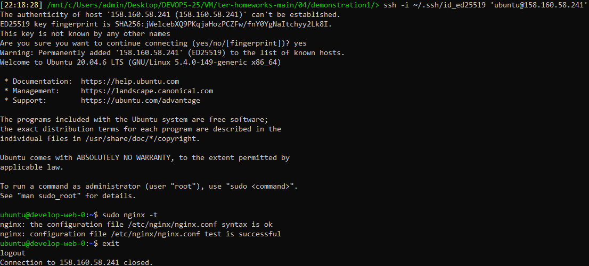
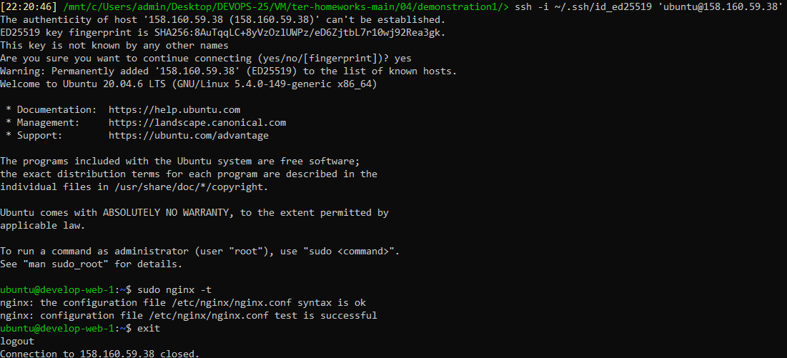
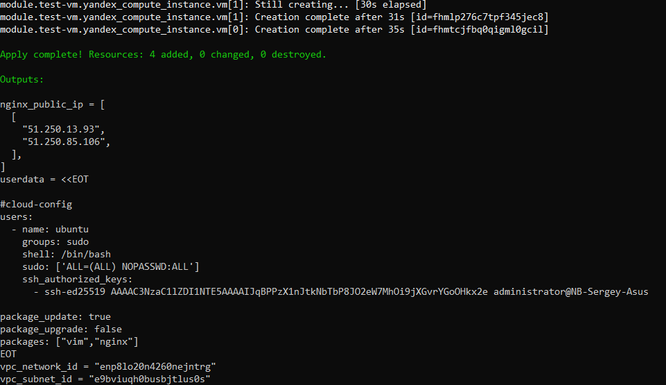
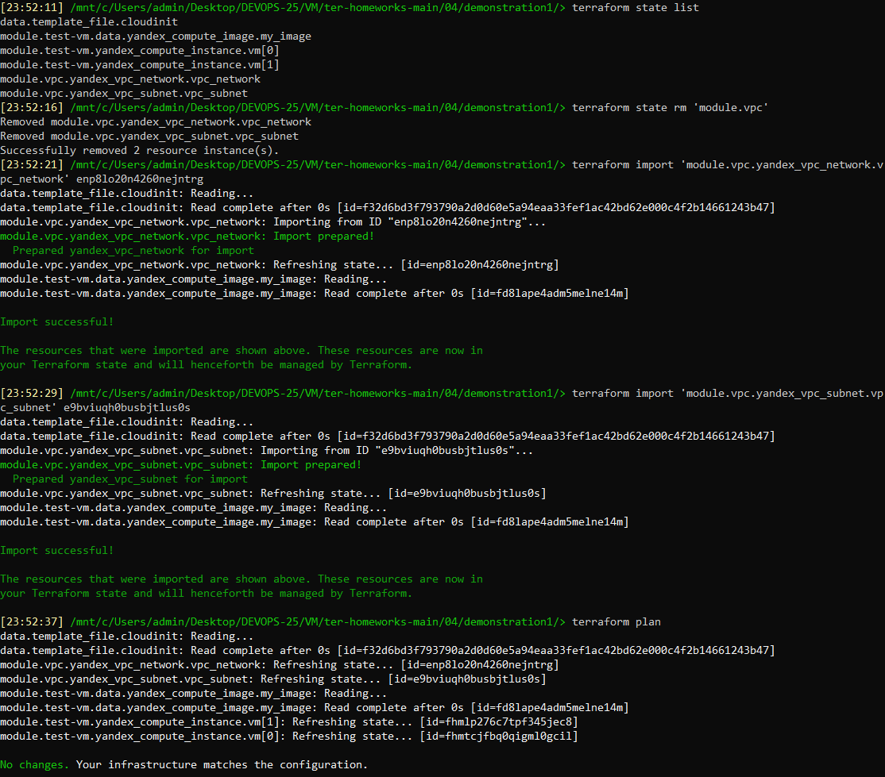

# Домашнее задание 07-ter-homeworks-04 «Продвинутые методы работы с Terraform»

<br>

## Задание 1
### 1. Взял из [демонстрации к лекции готовый код](https://github.com/netology-code/ter-homeworks/tree/main/04/demonstration1) для создания ВМ с помощью remote модуля.
```
terraform init
mv personal.auto.tfvars_example personal.auto.tfvars
```
Внёс данные в **personal.auto.tfvars**

### 2. Создал 1 ВМ, используя данный модуль. В файле cloud-init.yml использовал переменную для ssh ключа вместо хардкода. Передал ssh-ключ в функцию template_file в блоке vars ={}.
Воспользовался [**примером**](https://grantorchard.com/dynamic-cloudinit-content-with-terraform-file-templates/). Обратил внимание, что ssh-authorized-keys принимает в себя список, а не строку!

#### Привел файл cloud-init.yml к виду:
```
#cloud-config
users:
  - name: ${username}
    groups: sudo
    shell: /bin/bash
    sudo: ['ALL=(ALL) NOPASSWD:ALL']
    ssh_authorized_keys:
      - ${ssh_public_key}
package_update: true
package_upgrade: false
packages: ${packages}
```

#### В файле main.tf часть кода привёл к виду:
```
#Пример передачи cloud-config в ВМ для демонстрации №3
data "template_file" "cloudinit" {
 template = file("./cloud-init.yml")
 
	### ADDED
	vars = {
		username           = var.username
		ssh_public_key     = file(var.ssh_public_key)
		packages           = jsonencode(var.packages)
	}
	
}
```

#### В конец файла variables.tf добавил:
```
### ADDED

variable username {
  type = string
  default = "ubuntu"
}

variable ssh_public_key {
  type    = string
  default = "~/.ssh/id_ed25519.pub"
}

variable packages {
  type    = list
  default = ["vim", "nginx"]
}
```

### 3. Добавил в файл cloud-init.yml установку nginx.
### 4. Предоставляю скриншот подключения к консоли и вывод команды **sudo nginx -t**.
```
terraform plan
terraform apply
```
```
ssh -i ~/.ssh/id_ed25519 'ubuntu@158.160.58.241'
sudo nginx -t
exit
```


```
ssh -i ~/.ssh/id_ed25519 'ubuntu@158.160.59.38'
sudo nginx -t
exit
```

<br>

## Задание 2
### 1. Написал локальный модуль vpc, который будет создавать 2 ресурса: **одну** сеть и **одну** подсеть в зоне, объявленной при вызове модуля. Например: ```ru-central1-a```.
### 2. Модуль возвращает значения vpc.id и subnet.id
### 3. Заменил ресурсы yandex_vpc_network и yandex_vpc_subnet, созданные модулем.
### 4. Сгенерировал документацию к модулю с помощью terraform-docs.
Исходный код и документация модуля [**vpc**](demonstration1/vpc)
```
curl -Lo ./terraform-docs.tar.gz https://github.com/terraform-docs/terraform-docs/releases/download/v0.16.0/terraform-docs-v0.16.0-$(uname)-amd64.tar.gz
tar -xzf terraform-docs.tar.gz
chmod +x terraform-docs
mv terraform-docs /usr/local/terraform-docs
cd vpc
/usr/local/terraform-docs markdown table --output-file README.md .
```

<br>

## Задание 3
### 1. Вывел список ресурсов в стейте.
### 2. Удалил из стейта модуль vpc.
### 3. Импортировал его обратно. Проверил terraform plan - изменений быть не должно.
```
terraform state list
terraform state rm 'module.vpc'
terraform import 'module.vpc.yandex_vpc_network.vpc_network' enp8lo20n4260nejntrg
terraform import 'module.vpc.yandex_vpc_subnet.vpc_subnet' e9bviuqh0busbjtlus0s
terraform plan
```

<br>