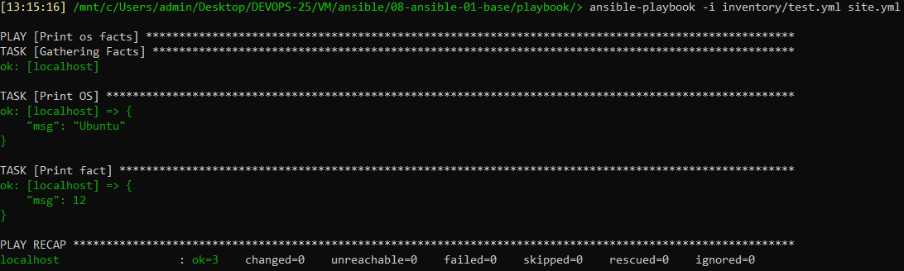
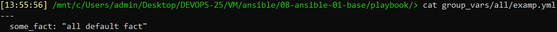
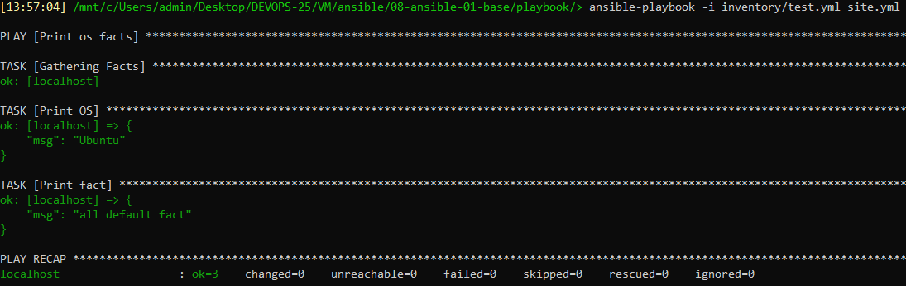
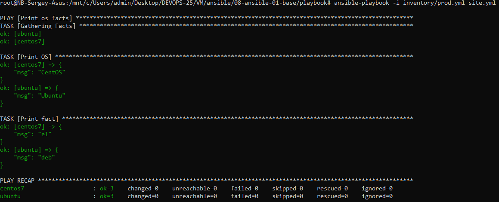
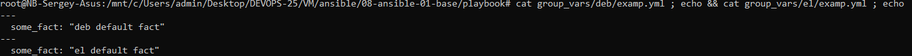
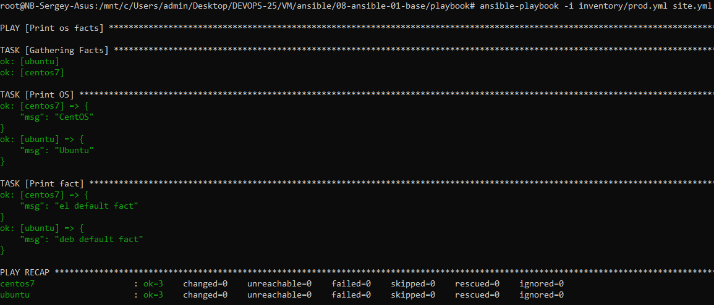
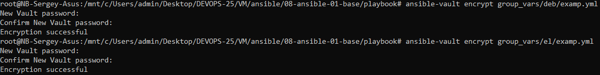
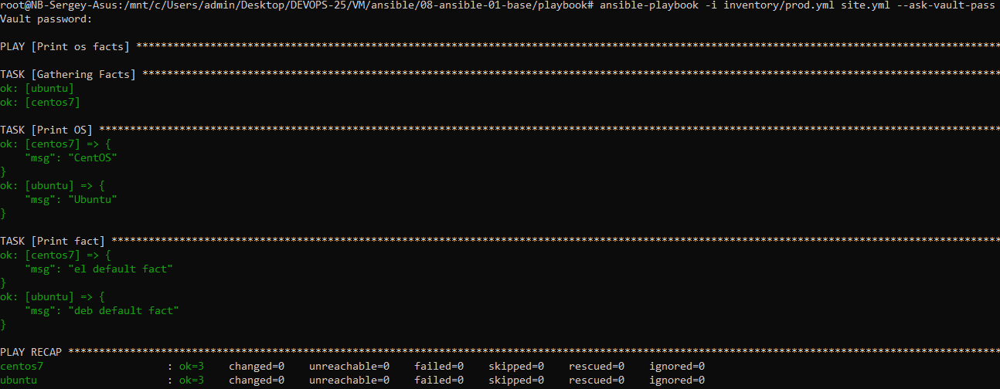
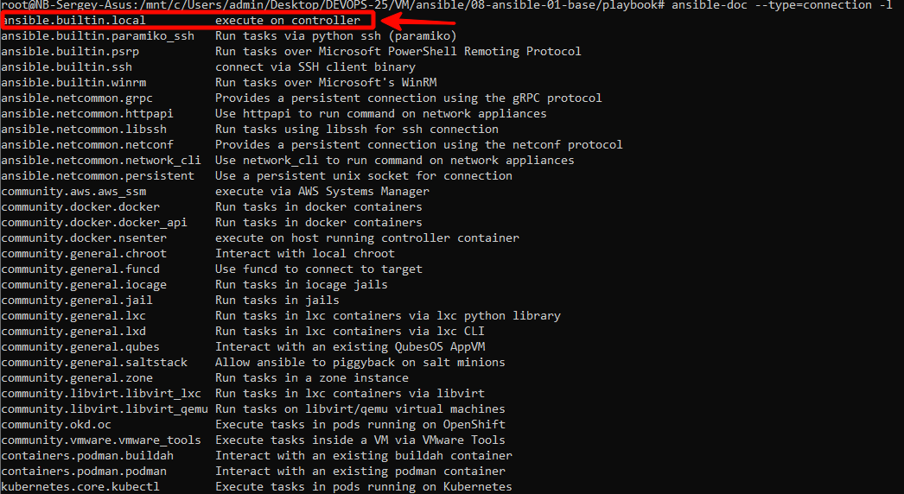
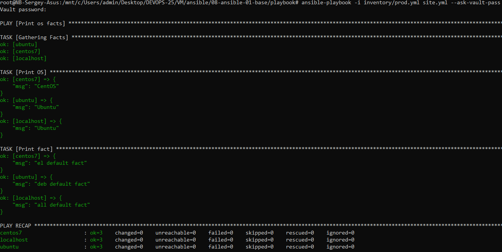

# Домашнее задание 08-ansible-01-base «Введение в Ansible»

<br>

## Задание 1
### Запустил playbook на окружении из `test.yml`, зафиксировал значение, которое имеет факт `some_fact` для указанного хоста при выполнении playbook.
```
cd playbook
ansible-playbook -i inventory/test.yml site.yml
```

<br>

## Задание 2
### Нашёл файл с переменными (group_vars), в котором задаётся найденное в первом пункте значение, и поменял его на `all default fact`.
```
cat group_vars/all/examp.yml
```


```
ansible-playbook -i inventory/test.yml site.yml
```

<br>

## Задание 3
### Создал окружение для проведения дальнейших испытаний.
#### Использую следующий docker-compose.yaml:
```
version: "3.6"

services:
  centos7:
    image: centos:7
    container_name: centos7
    command: tail -f /dev/null
  ubuntu:
    image: pycontribs/ubuntu:latest
    container_name: ubuntu
    command: tail -f /dev/null
```
В основном образе нет Python нужной версии, использую сторонний образ Ubuntu.
<br>

## Задание 4
### Провёл запуск playbook на окружении из `prod.yml`. Зафиксировал полученные значения `some_fact` для каждого из `managed host`.
```
ansible-playbook -i inventory/prod.yml site.yml
```

<br>

## Задание 5
### Добавил факты в `group_vars` каждой из групп хостов так, чтобы для `some_fact` получились значения: для `deb` — `deb default fact`, для `el` — `el default fact`.
```
cat group_vars/deb/examp.yml ; echo && cat group_vars/el/examp.yml ; echo
```

<br>

## Задание 6
### Повторил запуск playbook на окружении `prod.yml`. Убедился, что выдаются корректные значения для всех хостов.
```
ansible-playbook -i inventory/prod.yml site.yml
```

<br>

## Задание 7
### При помощи `ansible-vault` зашифровал факты в `group_vars/deb` и `group_vars/el` с паролем `netology`.
```
ansible-vault encrypt group_vars/deb/examp.yml
ansible-vault encrypt group_vars/el/examp.yml
```

<br>

## Задание 8
### Запустил playbook на окружении `prod.yml`. При запуске `ansible` запросил пароль. Убедился в работоспособности.
```
ansible-playbook -i inventory/prod.yml site.yml --ask-vault-pass
```

<br>

## Задание 9
### Посмотрел при помощи `ansible-doc` список плагинов для подключения. Выбрал подходящий для работы на `control node`.
```
ansible-doc --type=connection -l
```

<br>

## Задание 10
### В `prod.yml` добавил новую группу хостов с именем  `local`, в ней разместил localhost с необходимым типом подключения.
#### Исправленный prod.yml:
```
---
  el:
    hosts:
      centos7:
        ansible_connection: docker
  deb:
    hosts:
      ubuntu:
        ansible_connection: docker
  local:
    hosts:
      localhost:
        ansible_connection: local
```
<br>

## Задание 11
### Запустил playbook на окружении `prod.yml`. При запуске `ansible` запросил пароль. Убедился, что факты `some_fact` для каждого из хостов определены из верных `group_vars`.
```
ansible-playbook -i inventory/prod.yml site.yml --ask-vault-pass
```

<br>

## Задание 12
### Заполнил `README.md` ответами на вопросы. Сделал `git push` в ветку `master`. В ответе отправил ссылку мой открытый репозиторий с изменённым `playbook` и заполненным `README.md`.
<br>

